## Exercise 2: Build a Retrieval-Augmented Generation (RAG) Pipeline

### Task 1: Indexing Knowledge Sources 

1. Expand **assets (1)** folder, select **products.csv** file **(2)**. This file contains the  example data set that will be used in your chat app.

    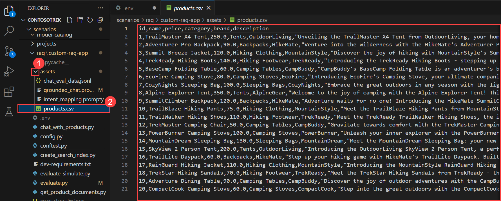

1. Select **create_search_index.py**, this file is used to store vectorized data from the embeddings model.  

    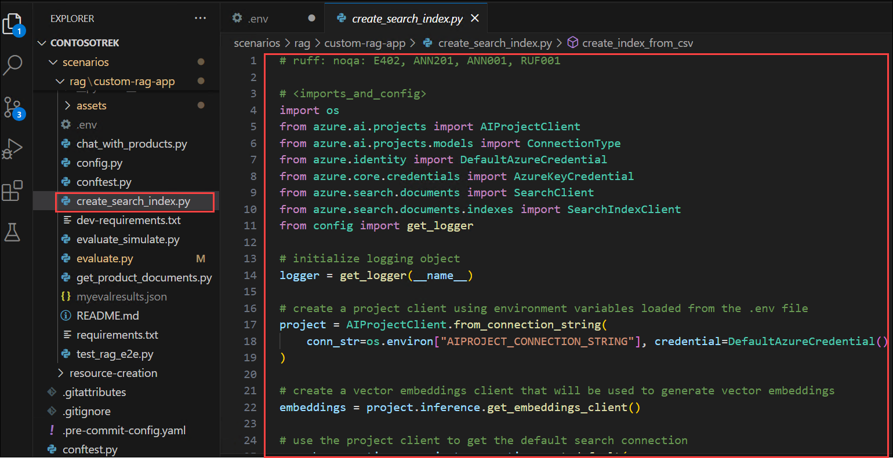

1. Go through the code, as it contains:

    - Code to import the required libraries, create a project client, and configure some settings:

      ```bash
      <imports_and_config>

      </imports_and_config>
      ```

    - Code to add the function to define a search index:  

      ```bash
      <create_search_index>

      </create_search_index>
       ```

    - Code to create the function to add a csv file to the index:    

      ```bash
      </add_csv_to_index>

      </add_csv_to_index>
      ```

    - Code to run the functions, to build the index and register it to the cloud project:  

      ```bash
      <test_create_index>

      </test_create_index>
      ```    

1. From your console, log in to your Azure account and follow instructions for authenticating your account:

    ```bash
    az login
    ```

    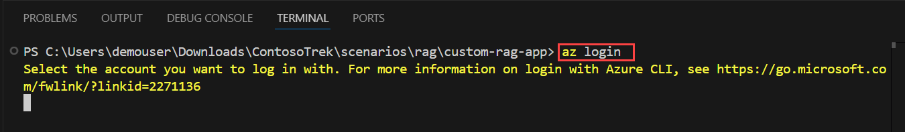

1. Minimize the Visual Studio Code window,

    - Select **Work or school account (1)**, click on **Continue (2)**

      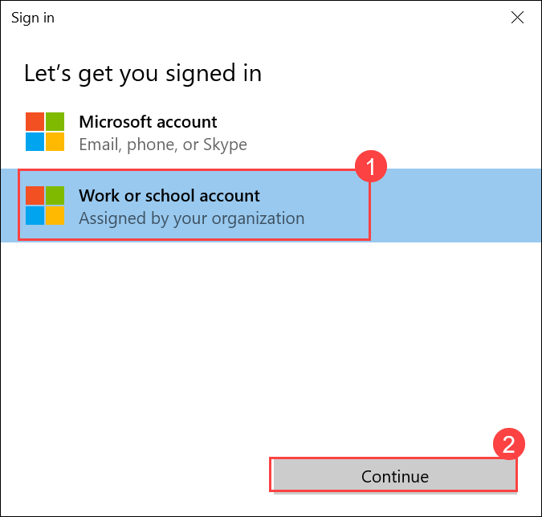    

    - Enter the **Username: <inject key="AzureAdUserEmail"></inject> (1)**,  then click on **Next (2)**

      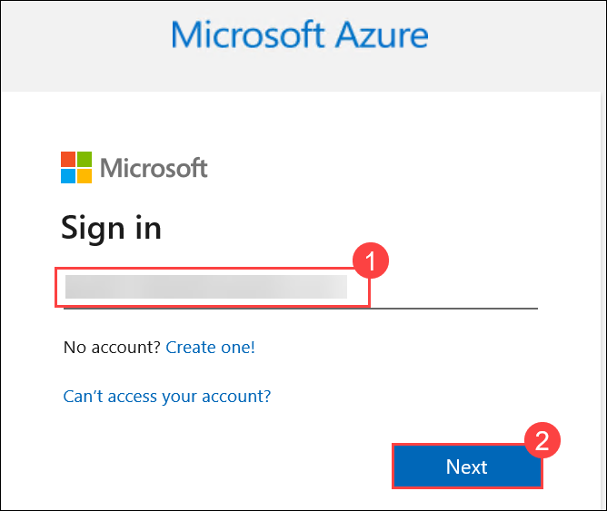  

    - Enter the **Password: <inject key="AzureAdUserPassword"></inject> (1)**,  then click on **Sign in (2)**

      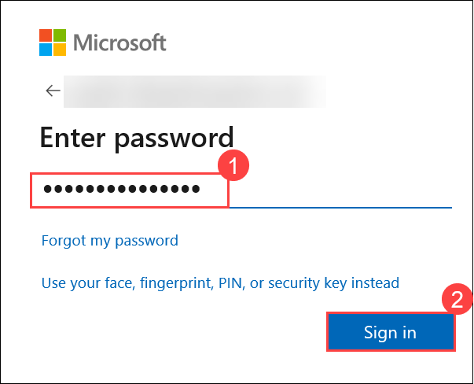    

    - Click on **No, sign in to this app only**

      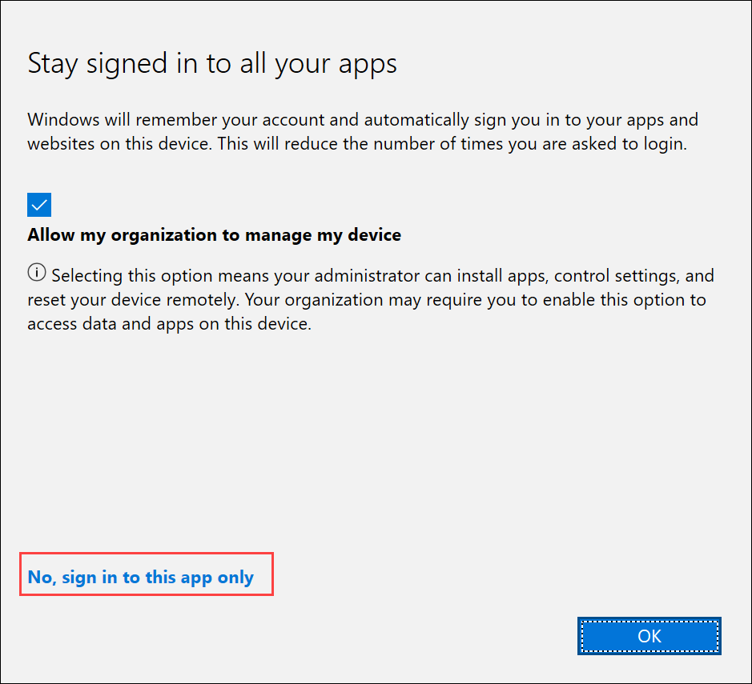      

1. Navigate back to the Visual Studio code terminal, press **Enter** to accept th default subscription.

    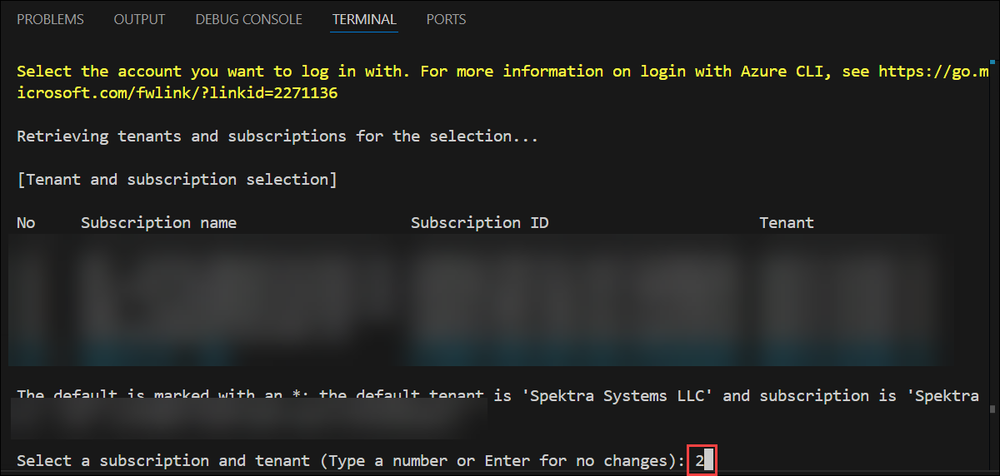

1. Run the code to build your index locally and register it to the cloud project:

    ```bash
    python create_search_index.py
    ```    

     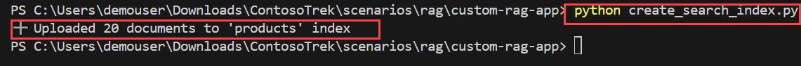    

### Task 2: Implementing the Retrieval Pipeline 

1. Select **get_product_documents.py** file, this file contains script to get product documents from the search index.

    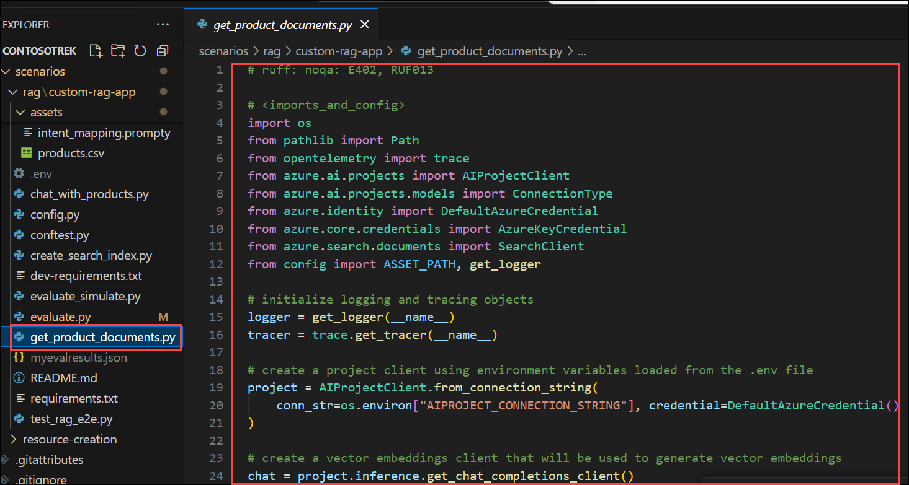

    - This file contains the code to import the required libraries, create a project client, and configure settings
    - Code to add the function to get product documents
    - Finally, add code to test the function when you run the script directly

1. Expand **assets (1)**, select **intent_mapping.prompty (2)**. This template instructs how to extract the user's intent from the conversation.      

    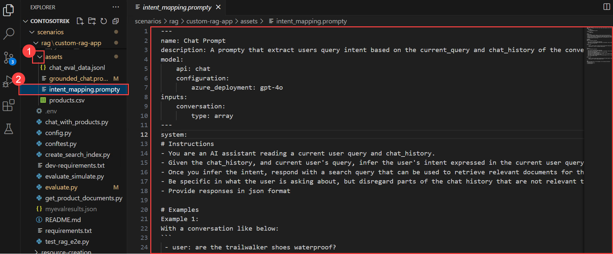

    - The **get_product_documents.py** script uses this prompt template to convert the conversation to a search query

1. Now run the below command in the terminal, to test out what documents the search index returns from a query.

    ```bash
    python get_product_documents.py --query "I need a new tent for 4 people, what would you recommend?"
    ```

     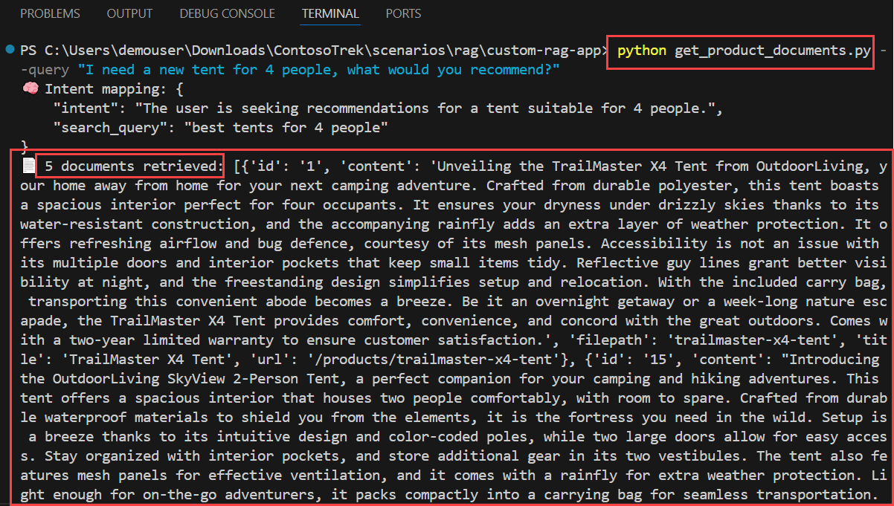     

### Task 3: Generating Responses with Augmented Knowledge     

1. Select **chat_with_products.py** file. This script retrieves product documents and generates a response to a user's question.

    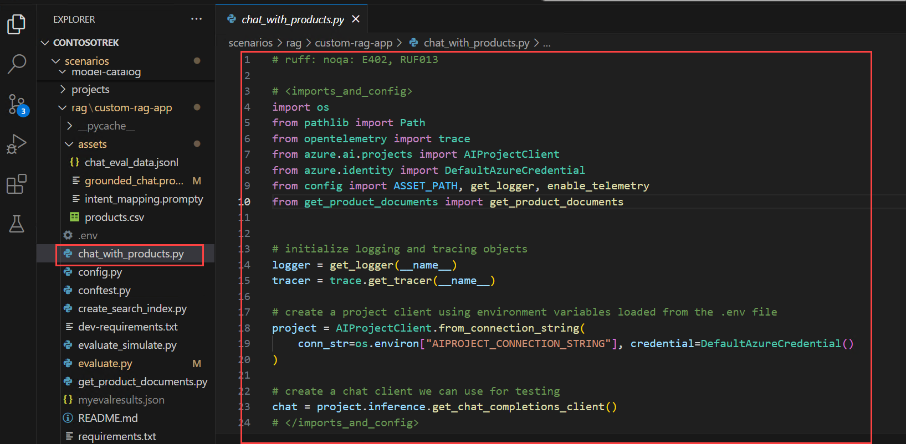

    - This script contains code to import the required libraries, create a project client, and configure settings   
    - Code to create the chat function that uses the RAG capabilities
    - Finally, add the code to run the chat function 

1. Expand **assets (1)** folder, select  **grounded_chat.prompty (2)**. This template instructs how to generate a response based on the user's question and the retrieved documents

    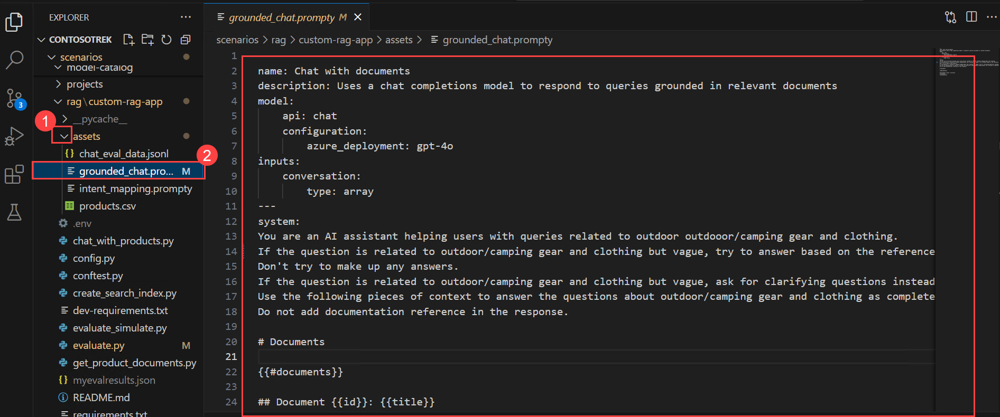

    - The **chat_with_products.py** script calls this prompt template to generate a response to the user's question

1. Run the below command in the terminal, to run the script to test your chat app with RAG capabilities.

    ```bash
    python chat_with_products.py --query "I need a new tent for 4 people, what would you recommend?"
    ```

     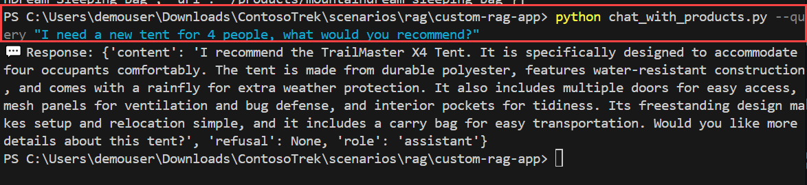  

### Task 4: Add telemetry logging

1. Navigate back to **Azure AI Foundary** portal.

1. Select **Tracing (1)** tab, to add an Application Insights resource to your projec and then click on **Create new (2)** to create a new resource.

    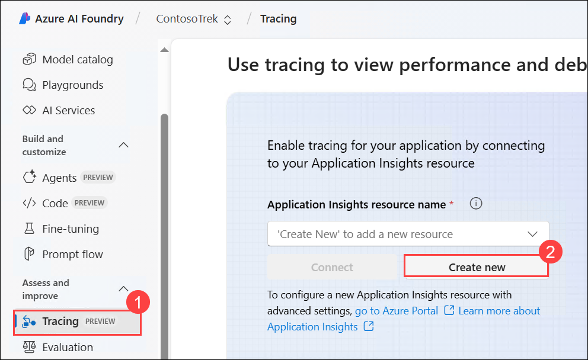

1. Enter the name as **Applicationinsight (1)**, then click on **Create (2)**.

    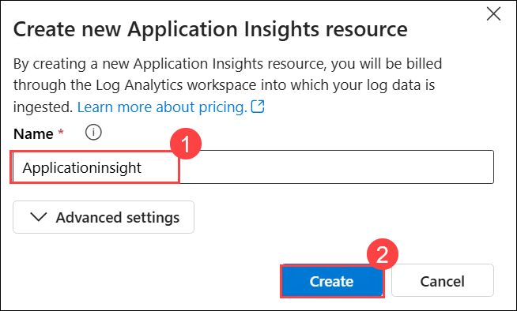

1. Navigate back to the VS Code terminal, run the below command to install the `azure-monitor-opentelemetry`:

   ```bash
   pip install azure-monitor-opentelemetry
   ```

    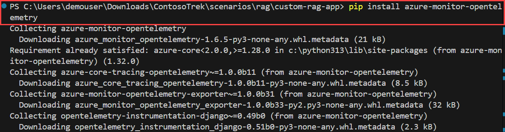   

     >**Note:** Wait for the installation to complete, this might take some time

1. Add the `--enable-telemetry` flag when you use the `chat_with_products.py` script:

   ```bash
   python chat_with_products.py --query "I need a new tent for 4 people, what would you recommend?" --enable-telemetry 
   ```      

    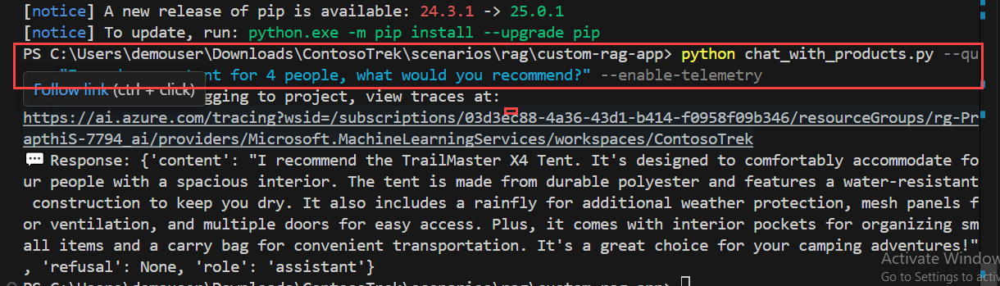   

1. Click on the link in the console output to see the telemetry data in your Application Insights resource **(1)** and click **Open (2)**.    

    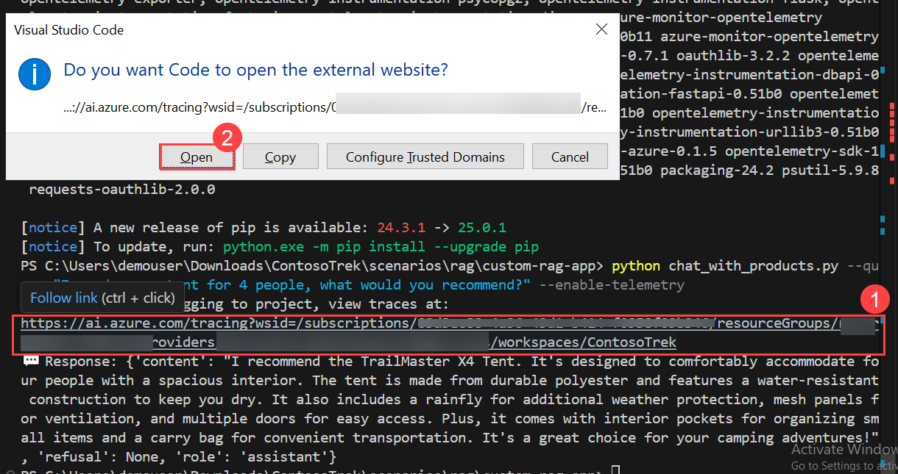

1. This will take you to the **Azure AI Foundary** portal, **Tracing** tab where you can see the telemetry data in your Application Insights resource. 

    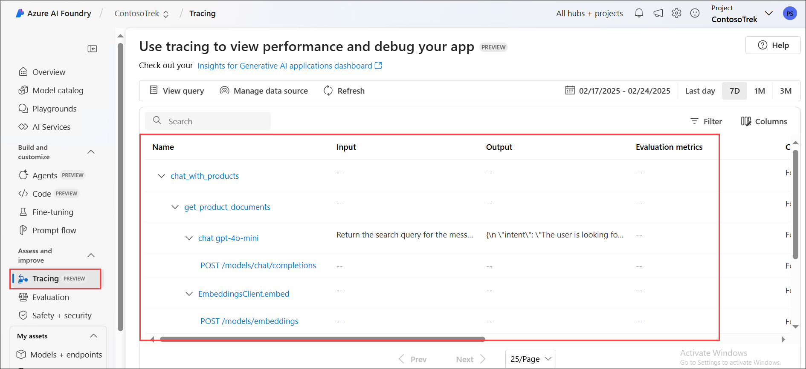

     >**Note:** If it doesn't appear right away, wait a few minutes and select **Refresh** in the toolbar.

1. In your project, you can **filter** your traces as you see fit. Click on **Filter**.

    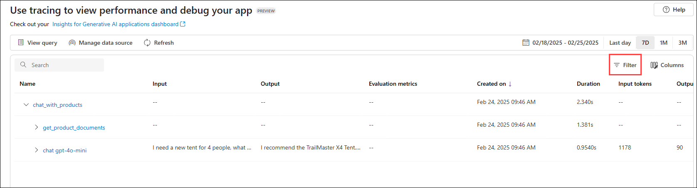

1. Click on **+ Add filter**, set the filter to **Success (1)**, **Equal to (2)** -> **True (3)** and then click on **Apply (4)**.

    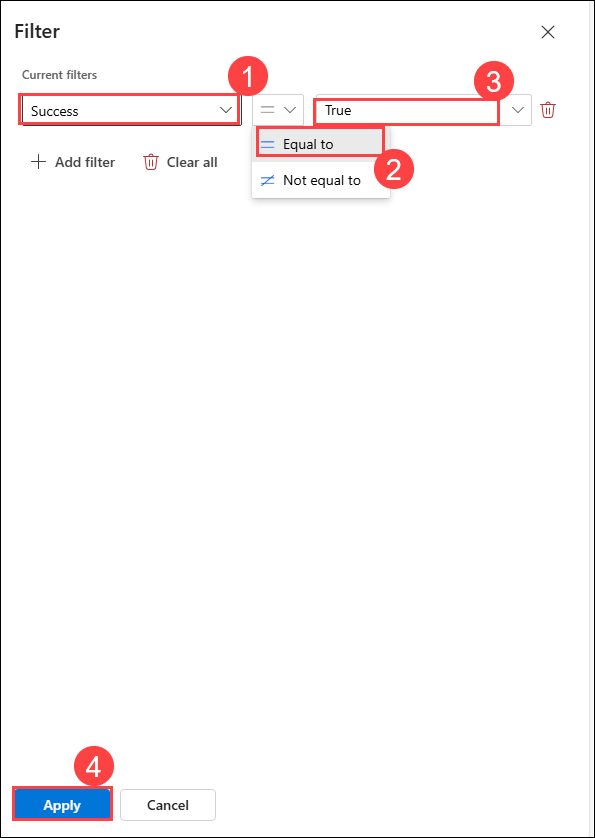

1. Now you can only see the data with Success as **True**.

    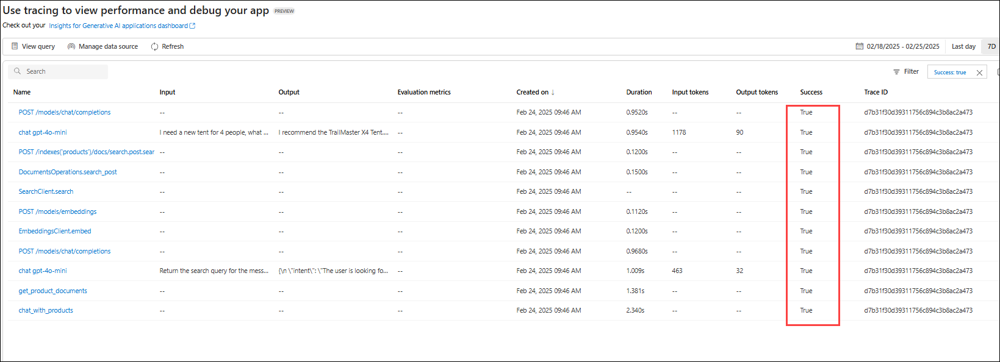


