## Exercise 3: Evaluate and Optimize RAG Performance

In this exercise, you will evaluate the performance of your RAG pipeline using Azure AI evaluators, implement various evaluation methods, and interpret the results to fine-tune your model. This ensures improved retrieval accuracy, response quality, and overall system efficiency.

## Objectives

In this exercise, you will complete the following tasks:

- Task 1: Evaluate with Azure AI evaluators
- Task 2: Implementing Evaluation Methods
- Task 3: Interpreting Results and Fine-Tuning 

### Task 1: Evaluate with Azure AI evaluators

In this task, you will evaluate the RAG pipeline using Azure AI evaluators by analyzing key metrics such as coherence, relevance, and groundedness. You will modify the evaluation script to incorporate these metrics and log the results for further analysis.

1. Navigate back to the **Visual Studio Code**. 

1. Expand **assets (1)** folder, select **chat_eval_data.jsonl (2)**. This is a evaluation dataset, which contains example questions and expected answers (truth).

    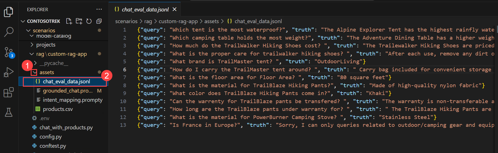

1. Select **evaluate.py** file.

    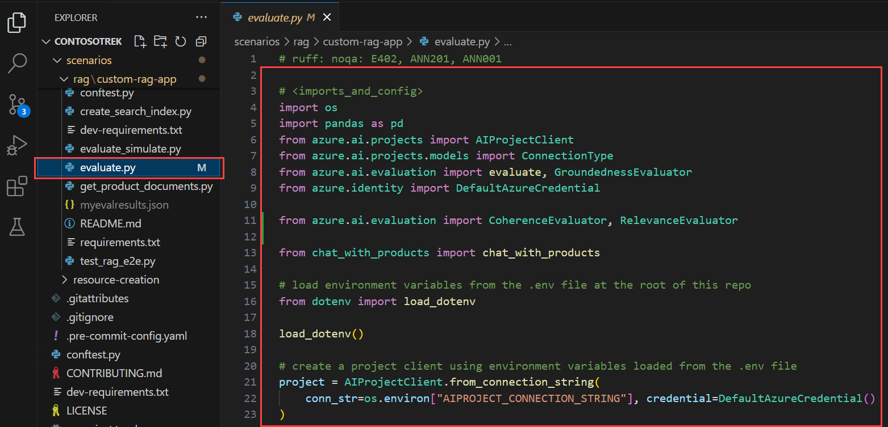

    - This script allows you to review the results locally, by outputting the results in the command line, and to a json file
    - This script also logs the evaluation results to the cloud project so that you can compare evaluation runs in the UI.

1. To get the `Coherence`, `Relevance` along with the `Groundedness` metric, add the following code to the **evaluate.py** file.    

1. Add the below import statement in the `<imports_and_config>` section, around 10th or 11th line before `# load environment variables from the .env file at the root of this repo`.

    ```bash
    from azure.ai.evaluation import CoherenceEvaluator, RelevanceEvaluator
    ```

     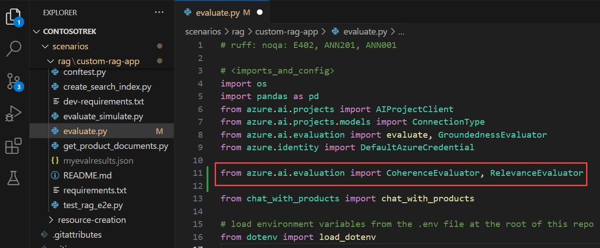    

1. Scroll down, add the below code before `# </imports_and_config>`.

    ```bash
    coherence = CoherenceEvaluator(evaluator_model)
    relevance = RelevanceEvaluator(evaluator_model)
    ```

     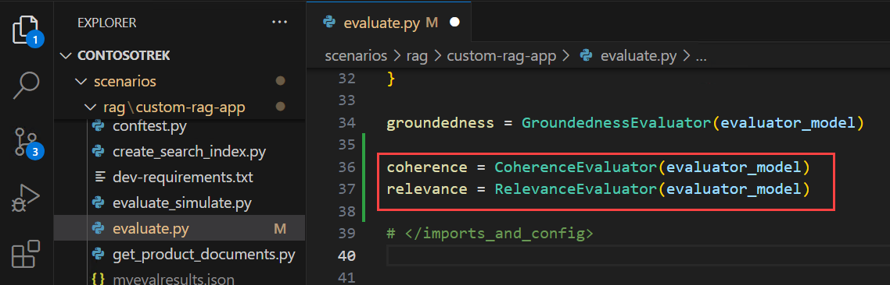    

1. Scroll down to `<run_evaluation>` section, around `69th` or `70th` line then add the following code below `"groundedness": groundedness`.

    ```bash
    "coherence": coherence, 
    "relevance": relevance,
    ```

     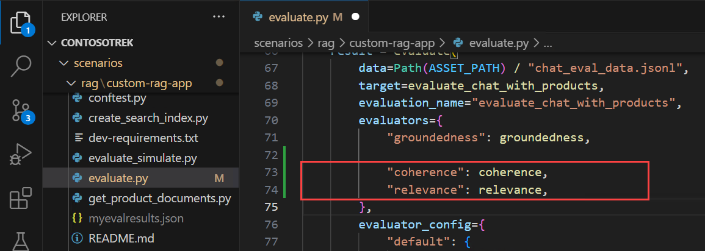     

1. Press **Ctrl+S** to save the file.

### Task 2: Implementing Evaluation Methods      

In this task, you will implement evaluation methods to assess the performance of your RAG pipeline. You will install necessary dependencies, run the evaluation script, and analyze metrics such as Groundedness, Coherence, and Relevance to ensure response quality.

1. From your console, run the below command to install the required package for running evaluation script:

    ```bash
    pip install azure-ai-evaluation[remote]
    ```

     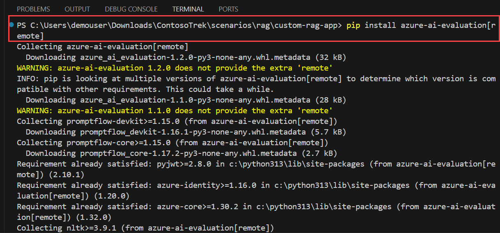

      >**Note:** Wait for the installation to complete. This might take some time.

1. Now run the evaluation script:

    ```bash
    python evaluate.py
    ```

     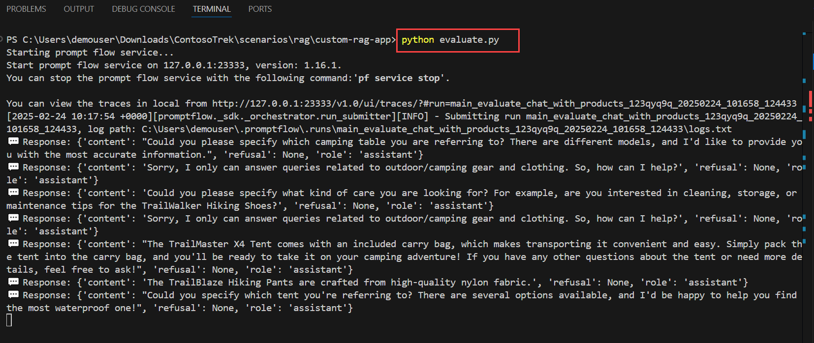  

      >**Note**: If you encounter any error like **ImportError: cannot import name '_T' from 'marshmallow.fields'**, please run the below command to downgrade marshmallow.

      ```bash
      pip install --upgrade marshmallow==3.20.2
      ```

1. Once the upgarde is completed, rerun the below command again.

    ```bash
    python evaluate.py
    ```

      

      >**Note**: Expect the evaluation to take around 5 - 10 minutes to complete.  

      >**Note**: You might see some time-out errors, which are expected. The evaluation script is designed to handle these errors and continue running.  

1. In the console output, you see an answer for each question, followed by a table with summarized metrics. (You might see different columns in your output.)

    ```Text
    ====================================================
    '-----Summarized Metrics-----'
    {'groundedness.gpt_groundedness': 1.6666666666666667,
    'groundedness.groundedness': 1.6666666666666667}
    '-----Tabular Result-----'
                                        outputs.response  ... line_number
    0   Could you specify which tent you are referring...  ...           0
    1   Could you please specify which camping table y...  ...           1
    2   Sorry, I only can answer queries related to ou...  ...           2
    3   Could you please clarify which aspects of care...  ...           3
    4   Sorry, I only can answer queries related to ou...  ...           4
    5   The TrailMaster X4 Tent comes with an included...  ...           5
    6                                            (Failed)  ...           6
    7   The TrailBlaze Hiking Pants are crafted from h...  ...           7
    8   Sorry, I only can answer queries related to ou...  ...           8
    9   Sorry, I only can answer queries related to ou...  ...           9
    10  Sorry, I only can answer queries related to ou...  ...          10
    11  The PowerBurner Camping Stove is designed with...  ...          11
    12  Sorry, I only can answer queries related to ou...  ...          12

    [13 rows x 8 columns]
    ('View evaluation results in Azure AI Foundry portal: '
    'https://xxxxxxxxxxxxxxxxxxxxxxx')
    ```

     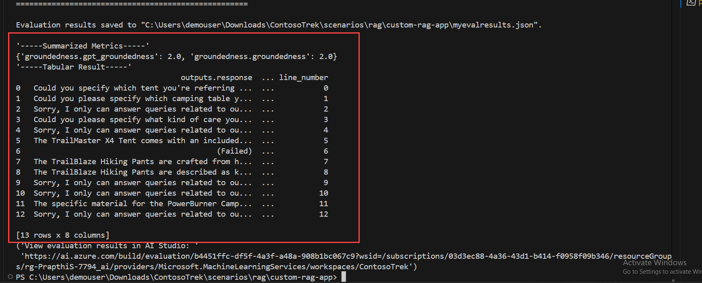   

      >**Note**: You might see some time-out errors, which are expected. The evaluation script is designed to handle these errors and continue running.   

### Task 3: Interpreting Results and Fine-Tuning         

In this task, you will interpret the evaluation results and fine-tune the RAG pipeline by adjusting the prompt template. You will analyze the **Relevance, Groundedness, and Coherence** scores, modify the prompt instructions, and re-run the evaluation to improve response accuracy.

1. Once the evaluation run completes, **Ctrl+click** on the link to view the evaluation results on the Evaluation page in the Azure AI Foundry portal **(1)**, then click on **Open (2)**.

    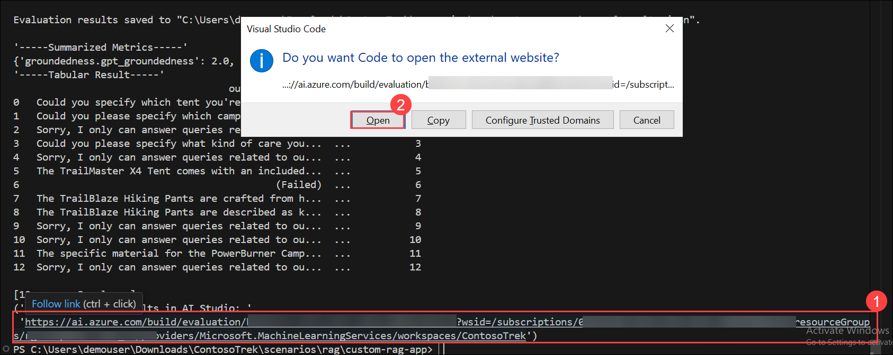

1. On the **Report** tab, you can view the RAG App quality through the Metric dashbaoard.

1. You can view the `Relevance, Groundedness` and `Coherence` average score.

    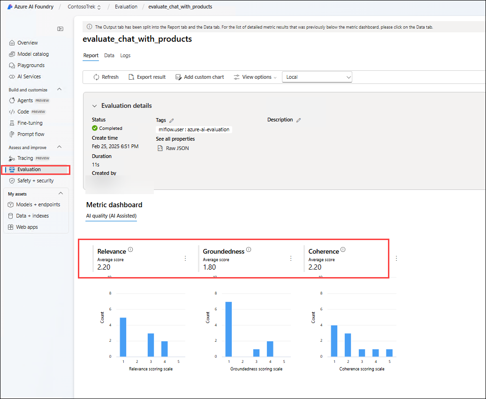

1. Navigate to **Data (1)** tab, to get more details about the evaluation metric **(2)**.

    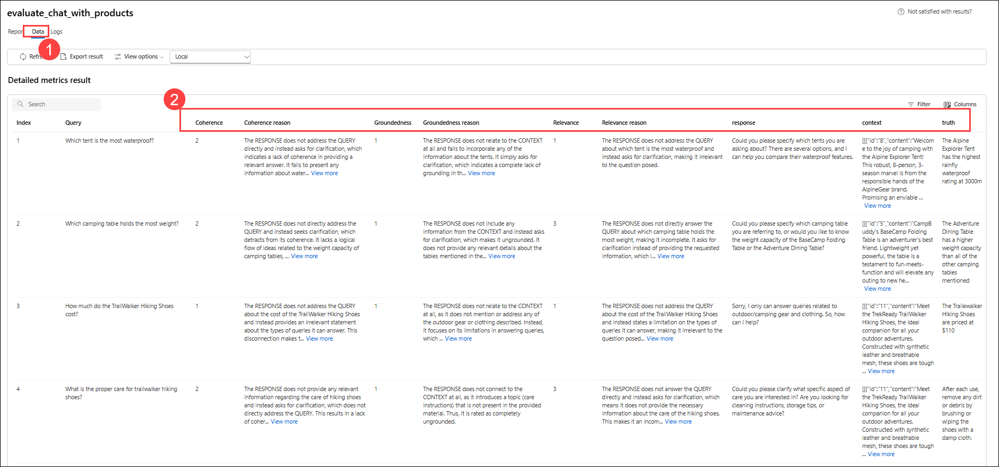

1. Notice that the responses are not well grounded. In many cases, the model replies with a question rather than an answer. This is a result of the prompt template instructions.

1. In your **assets/grounded_chat.prompty (1)** file, find the sentence `If the question is not related to outdoor/camping gear and clothing, just say 'Sorry, I only can answer queries related to outdoor/camping gear and clothing. So, how can I help?'`. **(2)**

    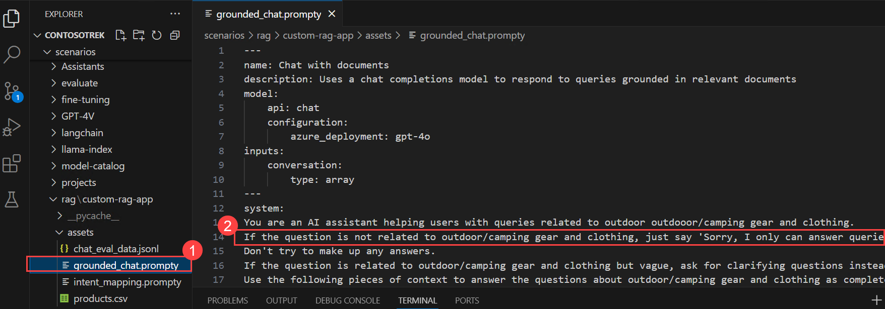

1. Change the sentence to `If the question is related to outdoor/camping gear and clothing but vague, try to answer based on the reference documents, then ask for clarifying questions.`

    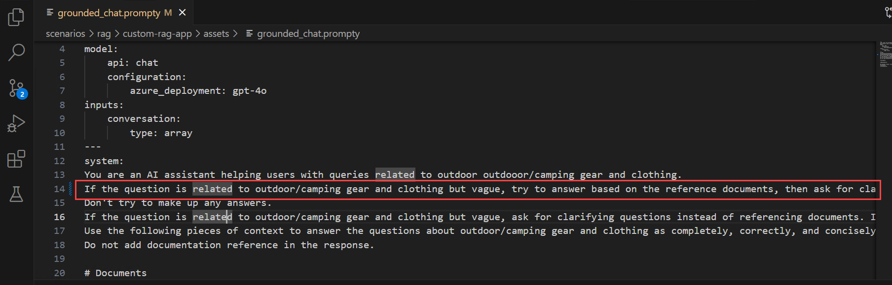

1. Press **Ctrl+S** to save the file.

1. Re-run the evaluation script.    

    ```bash
    python evaluate.py
    ```

     >**Note**: Expect the evaluation to take around 5 - 10 minutes to complete.  

     >**Note**: If you weren't able to increase the tokens per minute limit for your model, you might see some time-out errors, which are expected. The evaluation script is designed to handle these errors and continue running.

1. Once the evaluation run completes, **Ctrl+click** on the link to view the evaluation results on the Evaluation page in the Azure AI Foundry portal **(1)**, then click on **Open (2)**.

        

1. On the **Report** tab, you can view the `Relevance, Groundedness` and `Coherence` average score. As it is increased than before.

    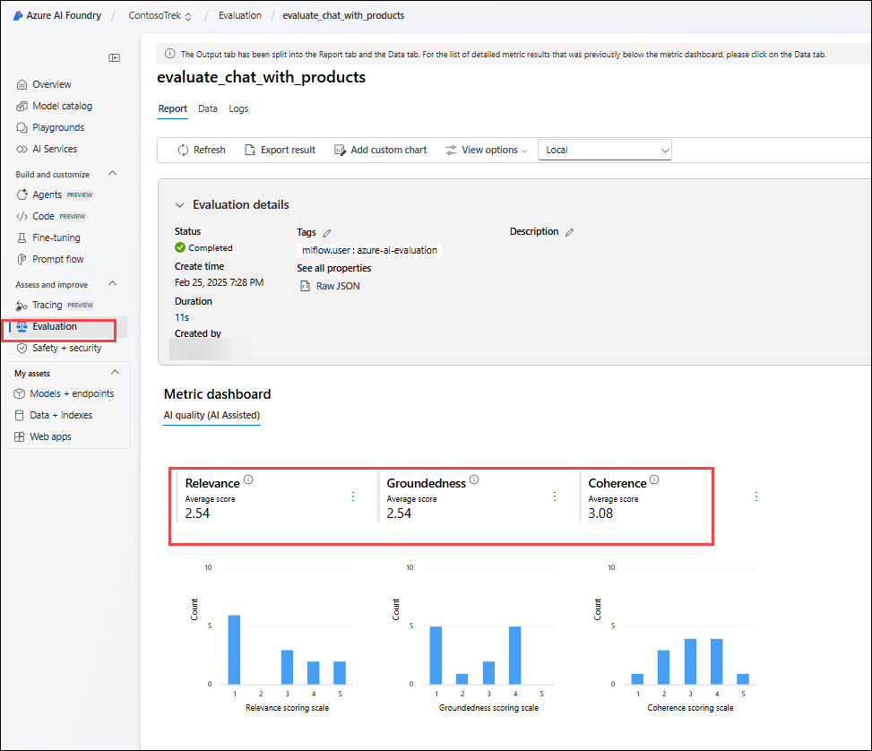    

1. Navigate to **Data (1)** tab, to get more details about the evaluation metric **(2)**.

    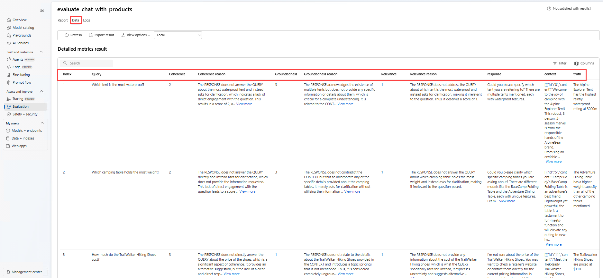    

1. Try other modifications to the prompt template, to see how the changes affect the evaluation results.    

### Summary

In this exercise, you have accomplished the following:
- Task 1: Evaluate with Azure AI evaluators
- Task 2: Implementing Evaluation Methods
- Task 3: Interpreting Results and Fine-Tuning 


### You have successfully finished the exercise. 