# Build a custom knowledge retrieval (RAG) app with the Azure AI Foundry SDK

### Overall Estimated Duration: 4 Hours

## Overview

In this Hands-On Lab, you will learn how to build a custom knowledge retrieval-augmented generation (RAG) application using the Azure AI Foundry SDK. This lab will guide you through provisioning necessary resources, implementing a retrieval pipeline, and evaluating the system’s performance. By the end of the session, you will have a functional RAG solution that integrates Azure AI capabilities for enhanced knowledge retrieval and response generation.

## Objectives

By the end of this lab, you will be able to:

- **Set Up Azure AI Foundry SDK and Provision Resources**: Learn how to provision the required resources in Azure AI Studio to support knowledge retrieval and model inference.
- **Building a RAG pipeline**: Implement a retrieval-augmented generation system that indexes and retrieves relevant data to enhance AI-generated responses.
- **Evaluate and Optimize RAG Performance**: Apply best practices to measure retrieval accuracy, response quality, and system efficiency.

  
## Pre-requisites

- Familiarity with Azure OpenAI Service.
- Basic understanding of large language models and their applications.

## Architecture

The architecture flow involves using the Azure OpenAI Service to integrate your data with a large language model (LLM), allowing you to manage how the model interacts with your information by focusing on specific topics or blending it with pre-trained results. The service employs default content filters to detect and remove harmful content, and you can also apply custom filters tailored to your needs. This approach ensures that content filtering is effectively used to uphold responsible AI practices, providing insights into its role in maintaining secure and safe interactions.

## Architecture Diagram

  

## Explanation of Components

1. **Azure OpenAI**: Azure OpenAI Service provides REST API access to OpenAI's powerful language models and these models integrates with your data, enabling customized and secure interactions.
1. **Azure OpenAI Models**: Offers pre-trained and customizable large language models for various AI applications. These models allow for powerful AI-driven solutions by generating tailored and contextually relevant content based on well-crafted prompts.
1. **Azure CloudShell**: Azure CloudShell offers an integrated, browser-based shell experience for managing Azure resources. It provides a ready-to-use environment with pre-installed tools and access to both Bash and PowerShell.
1. **Storage Account**: Manages and stores data, providing scalable and secure cloud storage solutions.
1. **Content Filter**: Detects and removes harmful content to ensure safe and responsible AI interactions.

## Getting Started with the Lab
 
## Accessing Your Lab Environment
 
Once you're ready to dive in, your virtual machine and **Lab guide** will be right at your fingertips within your web browser.

   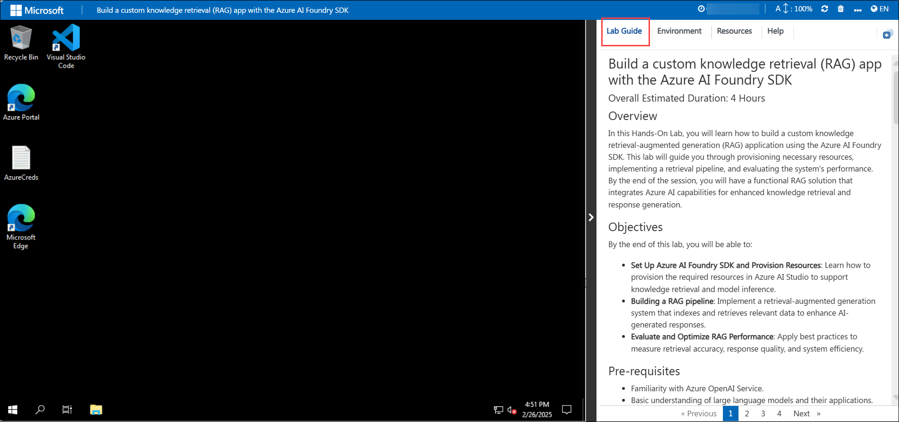

## Lab Guide Zoom In/Zoom Out

To adjust the zoom level for the environment page, click the **A↕ : 100%** icon located next to the timer in the lab environment.

   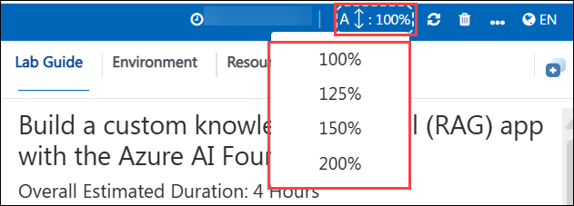

## Virtual Machine & Lab Guide
 
Your virtual machine is your workhorse throughout the workshop. The lab guide is your roadmap to success.
 
## Exploring Your Lab Resources
 
To get a better understanding of your lab resources and credentials, navigate to the **Environment** tab.
 
   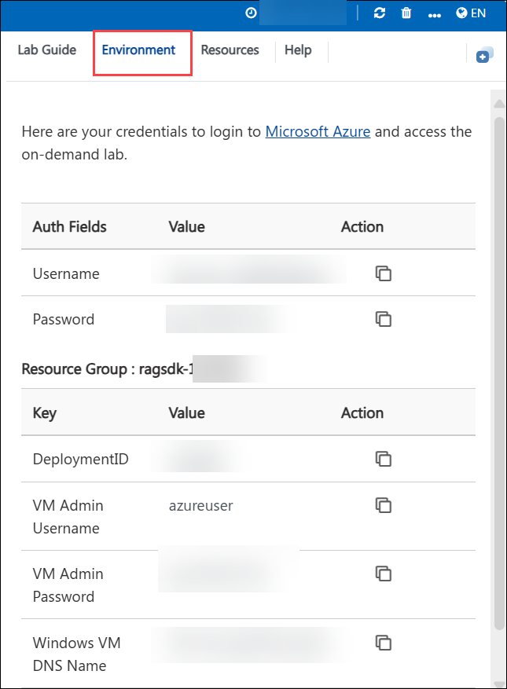
 
## Utilizing the Split Window Feature
 
For convenience, you can open the lab guide in a separate window by selecting the **Split Window** button from the Top right corner.
 
 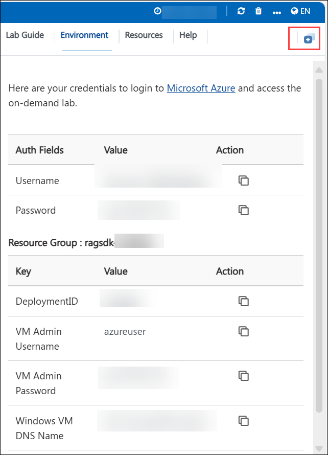
 
## Managing Your Virtual Machine
 
Feel free to **start, stop, or restart (2)** your virtual machine as needed from the **Resources (1)** tab. Your experience is in your hands!
 
 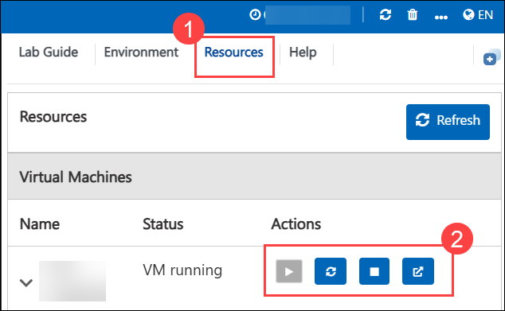

## Lab Validation

1. After completing the task, hit the **Validate** button under Validation tab integrated within your lab guide. If you receive a success message, you can proceed to the next task, if not, carefully read the error message and retry the step, following the instructions in the lab guide.

   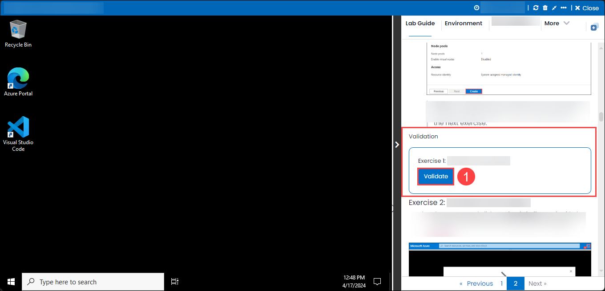

1. If you need any assistance, please contact us at cloudlabs-support@spektrasystems.com

## Let's Get Started with Azure Portal

1. On your virtual machine, click on the **Azure Portal** icon as shown below:

   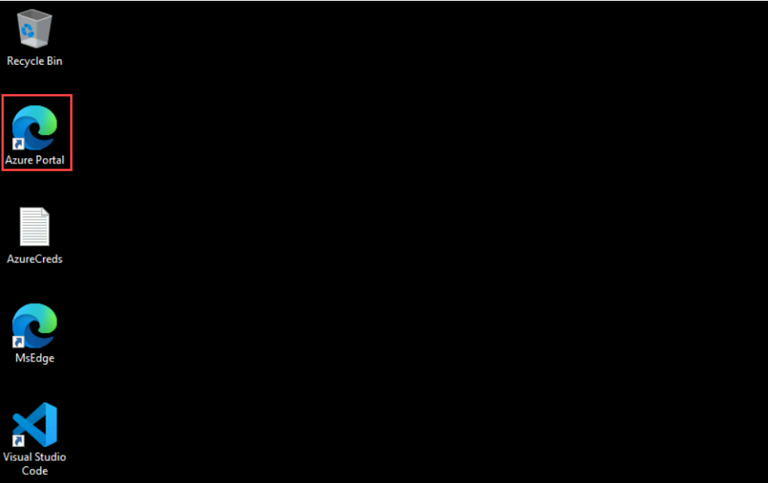
   
1. You'll see the **Sign into Microsoft Azure** tab. Here, enter your credentials:
 
   - **Email/Username:** <inject key="AzureAdUserEmail"></inject>
 
       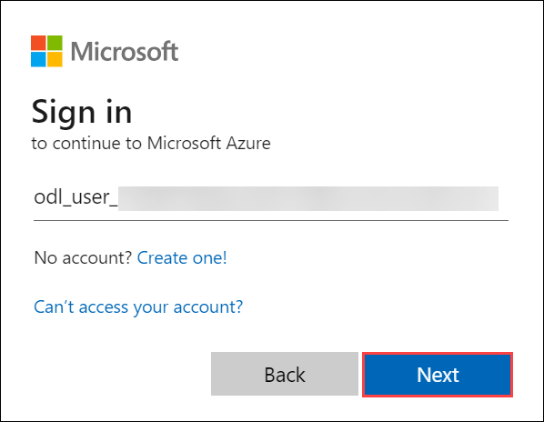
 
1. Next, provide your password:
 
   - **Password:** <inject key="AzureAdUserPassword"></inject>
 
       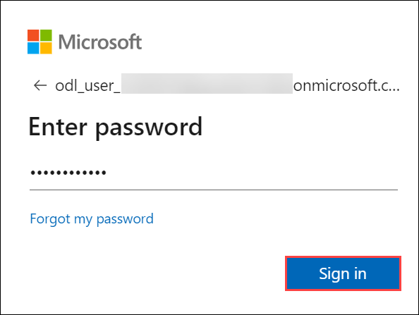

1. If **Action required** pop-up window appears, click on **Ask later**.

   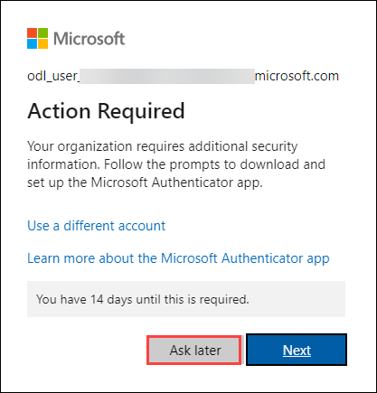
    
1. If prompted to stay signed in, you can click **No**.
 
1. If a **Welcome to Microsoft Azure** pop-up window appears, simply click **Cancel** to skip the tour.

1. Click **Next** from the bottom right corner to embark on your Lab journey!

   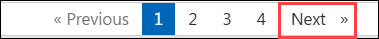

This hands-on-lab will help you to gain insights on how Azure OpenAI’s content filtering mechanisms contribute to responsible AI deployment, and how you can leverage these filters to ensure that your AI models adhere to appropriate content standards.

## Support Contact

The CloudLabs support team is available 24/7, 365 days a year, via email and live chat to ensure seamless assistance at any time. We offer dedicated support channels tailored specifically for both learners and instructors, ensuring that all your needs are promptly and efficiently addressed.

Learner Support Contacts:

- Email Support: cloudlabs-support@spektrasystems.com
- Live Chat Support: https://cloudlabs.ai/labs-support

Now, click on **Next** from the lower right corner to move on to the next page.

## Happy Learning!!
