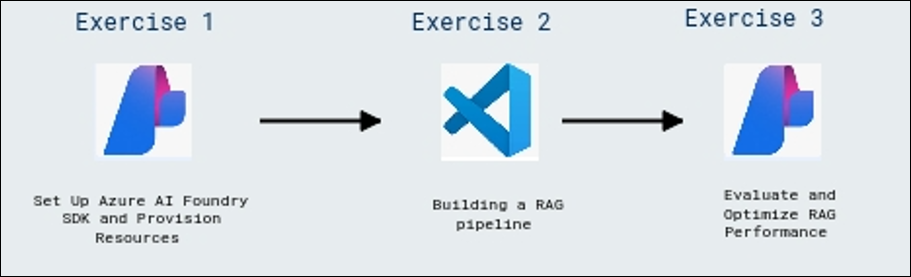

# Developing a Custom RAG App Using Azure AI Foundry

### Overall Estimated Duration: 4 Hours

## Overview

In this hands-on lab, you will learn how to build a custom Retrieval-Augmented Generation (RAG) application using the Azure AI Foundry SDK. You will begin by setting up the required Azure resources and configuring the AI Foundry environment. Then, you will implement an RAG pipeline that indexes and retrieves relevant data to enhance AI-generated responses. Finally, you will evaluate and optimize the system’s performance by measuring retrieval accuracy, response quality, and efficiency. By the end of the session, you will have a functional RAG solution that integrates Azure AI capabilities for enhanced knowledge retrieval and response generation.

## Objectives

By the end of this lab, you will be able to:

- **Set Up Azure AI Foundry SDK and Provision Resources**: In this hands-on exercise, participants will gain insights about setting up the Azure AI Foundry SDK and provisioning essential resources for knowledge retrieval and model inference. They will create a project, deploy AI models, configure Azure AI Search, integrate it with their project, clone a GitHub repository, and set up environment variables for seamless execution.

- **Building a RAG pipeline**: In this hands-on exercise, participants will gain insights about building a Retrieval-Augmented Generation (RAG) pipeline to enhance AI-generated responses. They will index knowledge sources, implement a retrieval pipeline, and generate responses enriched with relevant data. Additionally, they will integrate telemetry logging to monitor and optimize system performance.

- **Evaluate and Optimize RAG Performance**: In this hands-on exercise, participants will gain insights about evaluating and optimizing the performance of a Retrieval-Augmented Generation (RAG) system. They will use Azure AI evaluators to assess retrieval accuracy, implement evaluation methods to measure response quality, and interpret results to fine-tune the system’s efficiency.
  
## Prerequisites

- Familiarity with the Azure AI Foundry portal.
- Basic understanding of large language models and their applications.
- Familiarity with Retrieval-Augmented Generation (RAG) concepts.

## Architecture

The architecture flow involves using Azure AI Foundry to provision resources, including AI models and a vector database for knowledge retrieval. Visual Studio Code is used to develop the RAG application, integrating retrieval and generation components. Once deployed, the app is evaluated in Azure AI Foundry to monitor retrieval accuracy, response quality, and performance, ensuring an optimized AI system.

## Architecture Diagram

  

## Explanation of Components

1. **Azure AI Foundry**: Azure AI Foundry provides the foundational infrastructure, including AI models, vector databases, and necessary resources for deploying and managing Retrieval-Augmented Generation (RAG) pipelines. This platform enables the creation of AI applications that utilize retrieval systems to enhance the accuracy and relevance of AI-generated responses.

1. **Azure OpenAI**: Azure OpenAI Service provides REST API access to OpenAI's powerful language models, which integrate with your data, enabling customized and secure interactions.

1. **Azure OpenAI Models**: Azure OpenAI Models offer pre-trained and customizable large language models for various AI applications. These models help build powerful AI-driven solutions by generating tailored and contextually relevant content based on well-crafted prompts.

1. **Azure AI Search**: Azure AI Search, formerly known as Azure Cognitive Search, is an enterprise-ready information retrieval system that allows you to store, index, and search your data, enabling powerful retrieval-augmented generation (RAG) applications and enterprise search engines. 

1. **Visual Studio Code**: Serves as the development environment for building the RAG application, integrating retrieval mechanisms with AI-generated responses.

1. **Retrieval-Augmented Generation (RAG) Pipeline**: A Retrieval-Augmented Generation (RAG) pipeline enhances AI-generated responses by integrating external knowledge into the generation process. It involves retrieving pertinent information from a vector database based on user queries, which is then used to augment the AI's responses, leading to more accurate and contextually relevant outputs. 

1. **Evaluation & Monitoring (Azure AI Foundry)**: Tracks model performance, retrieval accuracy, and response quality, enabling continuous optimization and debugging.

## Getting Started with the Lab
 
## Accessing Your Lab Environment
 
Once you are ready to dive in, your virtual machine and **Lab Guide** will be right at your fingertips within your web browser.

   

## Lab Guide Zoom In/Zoom Out

To adjust the zoom level for the environment page, click the **A↕ : 100%** icon located next to the timer in the lab environment.

   

## Virtual Machine & Lab Guide
 
Your virtual machine is your workhorse throughout the workshop. The lab guide is your roadmap to success.
 
## Exploring Your Lab Resources
 
To get a better understanding of your lab resources and credentials, navigate to the **Environment** tab.
 
   
 
## Utilizing the Split Window Feature
 
For convenience, you can open the lab guide in a separate window by selecting the **Split Window** button from the top right corner.
 
 
 
## Managing Your Virtual Machine
 
Feel free to **start, stop, or restart (2)** your virtual machine as needed from the **Resources (1)** tab. Your experience is in your hands!
 
 

## Lab Validation

1. After completing the task, hit the **Validate (1)** button under the Validation tab integrated into your lab guide. You can proceed to the next task if you receive a success message. If not, carefully read the error message and retry the step, following the instructions in the lab guide.

   

1. If you need any assistance, please contact us at cloudlabs-support@spektrasystems.com.

## Let's Get Started with Azure Portal

1. On your virtual machine, click on the **Azure Portal** icon as shown below:

   
   
1. You will see the **Sign in to the Microsoft Azure** tab. Here, enter your credentials:
 
   - **Email/Username:** <inject key="AzureAdUserEmail"></inject>
 
       
 
1. Next, provide your password:
 
   - **Password:** <inject key="AzureAdUserPassword"></inject>
 
       

1. If an **Action required** pop-up window appears, click on **Ask later**.

   
    
1. If prompted to stay signed in, you can click **No**.
 
1. If a **Welcome to Microsoft Azure** pop-up window appears, click **Cancel** to skip the tour.

This hands-on lab will guide you in building a custom Retrieval-Augmented Generation (RAG) application using the Azure AI Foundry SDK. You will learn how to provision essential resources, develop a retrieval pipeline, and evaluate system performance. This lab will give you insights into how Azure AI Foundry enhances knowledge retrieval and response generation, enabling more accurate and context-aware AI applications.

## Support Contact

The CloudLabs support team is available 24/7, 365 days a year, via email and live chat to ensure seamless assistance anytime. We offer dedicated support channels tailored specifically for learners and instructors, ensuring that all your needs are promptly and efficiently addressed.

Learner Support Contacts:

- Email Support: cloudlabs-support@spektrasystems.com
- Live Chat Support: https://cloudlabs.ai/labs-support

Click **Next** from the lower right corner to move on to the next page.

## Happy Learning!!
