# Exercise 01: Developing a Custom RAG App Using Azure AI Foundry

## Estimated Time: 4 Hours

## Lab Scenario

In this hands-on lab, you will learn how to build a custom Retrieval-Augmented Generation (RAG) application using the Azure AI Foundry SDK. You will begin by setting up the required Azure resources and configuring the AI Foundry environment. Then, you will implement an RAG pipeline that indexes and retrieves relevant data to enhance AI-generated responses. Finally, you will evaluate and optimize the system’s performance by measuring retrieval accuracy, response quality, and efficiency. By the end of the session, you will have a functional RAG solution that integrates Azure AI capabilities for enhanced knowledge retrieval and response generation. 

## Lab Objectives

In this lab, you will complete the following exercises:

- Exercise 1: Set Up Azure AI Foundry SDK and Provision Resources 
- Exercise 2: Build a Retrieval-Augmented Generation (RAG) Pipeline 
- Exercise 3: Evaluate and Optimize RAG Performance 

## Exercise 1: Set Up Azure AI Foundry SDK and Provision Resources 

In this exercise, you will set up the Azure AI Foundry SDK and provision the necessary resources to support your RAG pipeline. This includes configuring the environment, deploying foundation models, and ensuring seamless integration with Azure AI services for knowledge retrieval and inference.

### Task 1: Create a Project

In this task, you will create a new project in Azure AI Foundry and configure the required resources.

1. Navigate to the home page of **Azure AI Foundry** by right-clicking on [Azure AI Foundry](https://ai.azure.com), selecting the **Copy link** option, and pasting it into your browser.

1. Click on **Sign in**.

    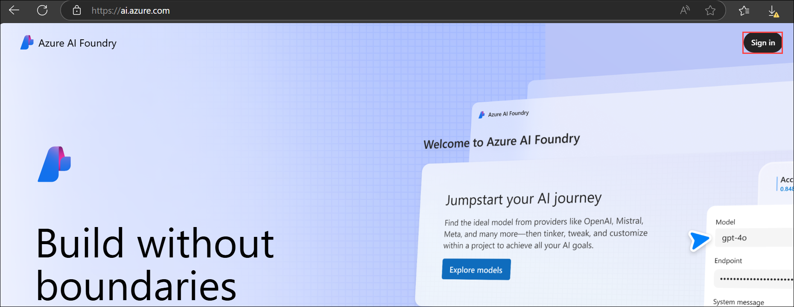 

     >**Note**: Select **Got it**, on the pop-up **Streamlined from the start**.

1. Select **+ Create project**.

    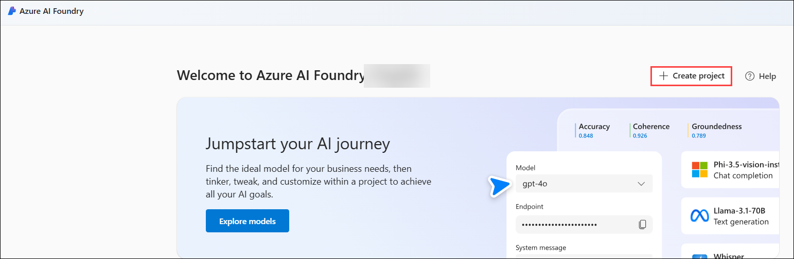 

1. Enter a name for the project as **ContosoTrek (1)**, then click on **Customize (2)**.

    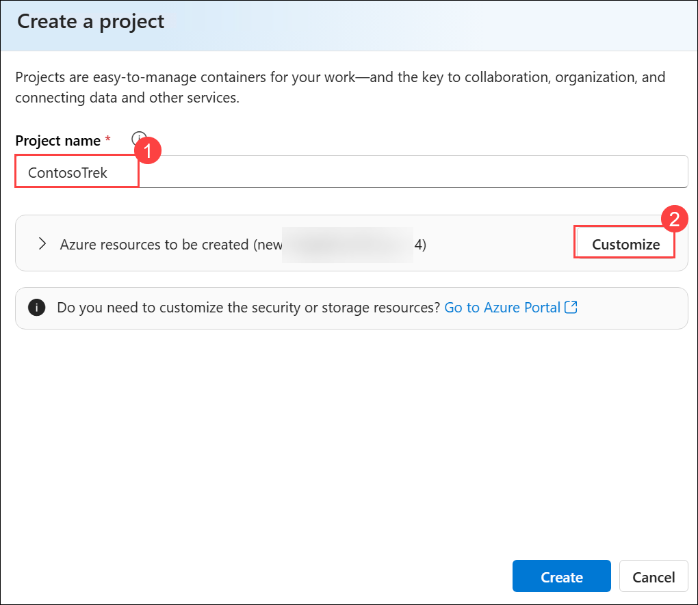 

1. On the **Create a project** page, provide the following details and then click on **Next (6)**:

    - Hub name: **ContosoHub (1)**

      >**Note**: If you see a permission error, ignore it. It will go away after selecting the required resource group.

    - Subscription: **Leave the default subscription (2)**
    - Resource group: Select **ragsdk-<inject key="DeploymentID" enableCopy="false"/> (3)** 
    - Location: **<inject key="Region" enableCopy="false"/> (4)**
    - Connect Azure AI Services or Azure OpenAI Service: **Leave default (5)**

      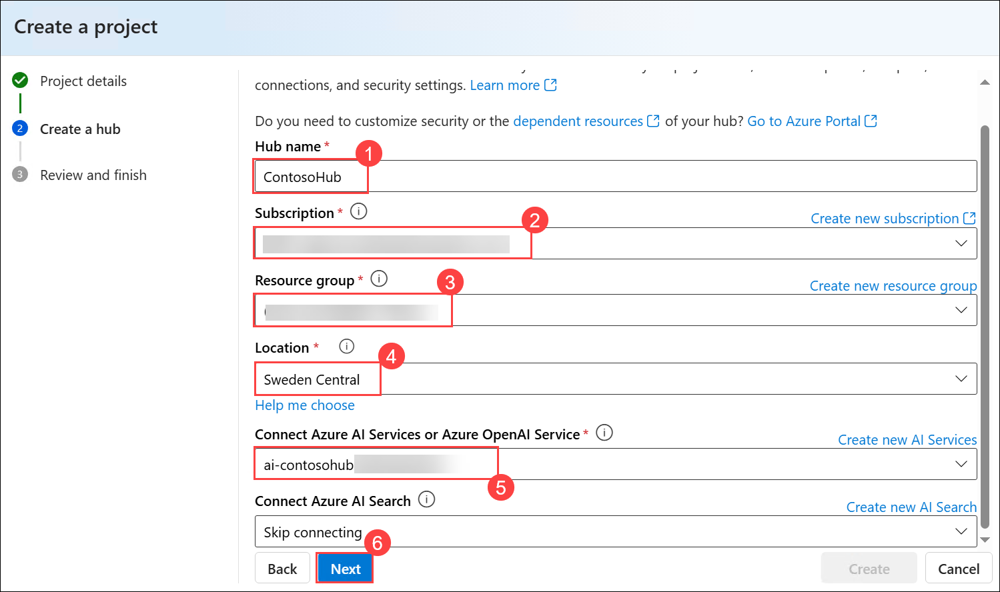     

1. Click on **Create** on the **Review and finish** page.

    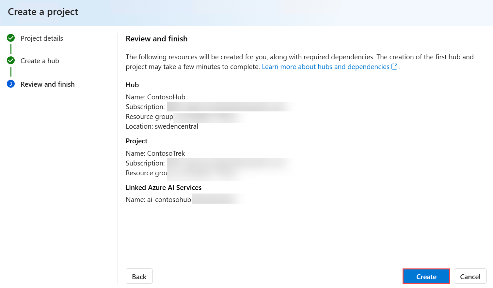

1. Wait until the resources are created.

    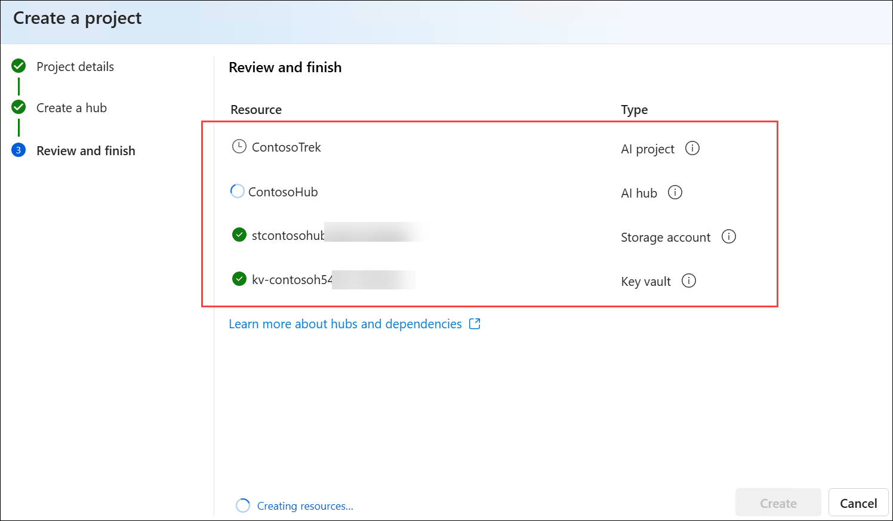

     >**Note**: Please **close** further pop-ups.

   > **Congratulations** on completing the task! Now, it's time to validate it. Here are the steps:    
   - Hit the validate button for the corresponding task. If you receive a success message, you can proceed to the next task.
   - If not, carefully read the error message and retry the step, following the instructions in the lab guide.
   - If you need any assistance, please contact us at cloudlabs-support@spektrasystems.com. We are available 24/7 to help you out.

   <validation step="116ffc00-e134-4fc6-82db-c383b9d13758" />

### Task 2: Deploying and Managing AI Models 

In this task, you will deploy models in your Azure AI Foundry project. You need two models to build a RAG-based chat app: an Azure OpenAI chat model (GPT-4o-mini) and an Azure OpenAI embedding model (text-embedding-ada-002).

1. On the left navigation pane, select **Model catalog (1)**. Search for **gpt-4o-mini (2)** and then select **gpt-4o-mini (3)**.

    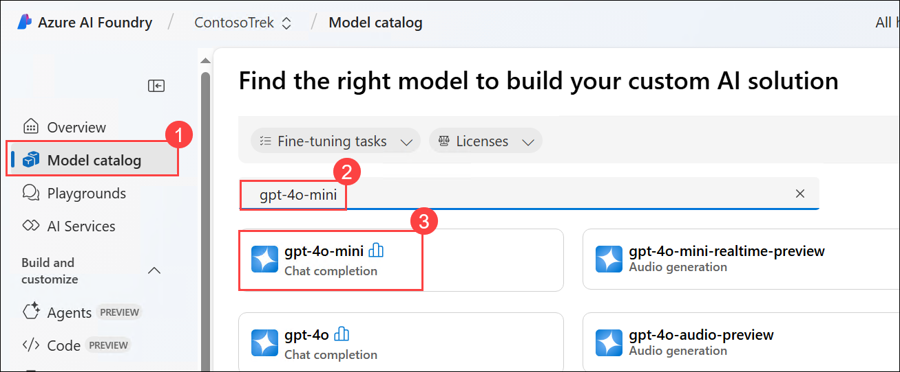

1. Click on **Deploy**.

    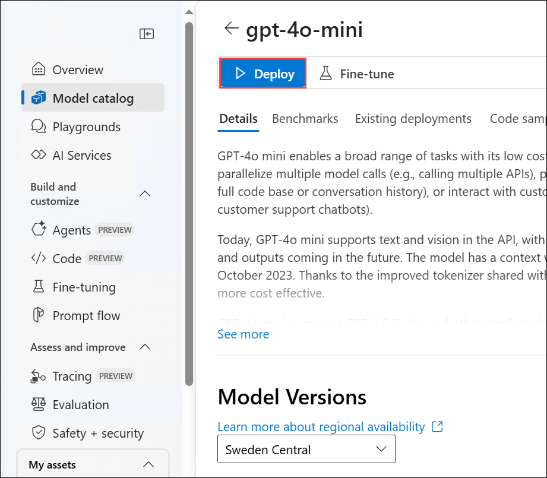

1. Click on **Deploy** again.

    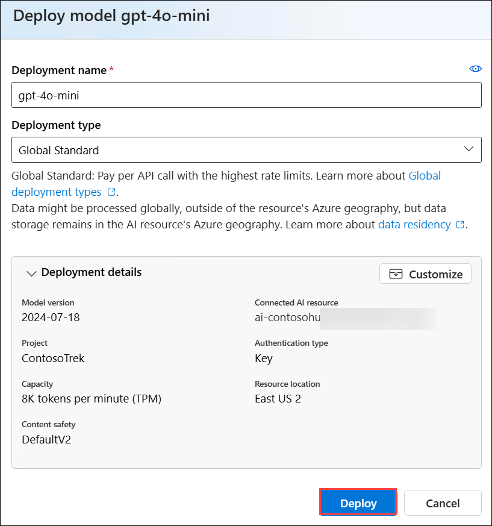

1. Click on the **Model catalog (1)** option twice, search for **text-embedding-ada-002 (2),** and then select **text-embedding-ada-002 (3)**.

    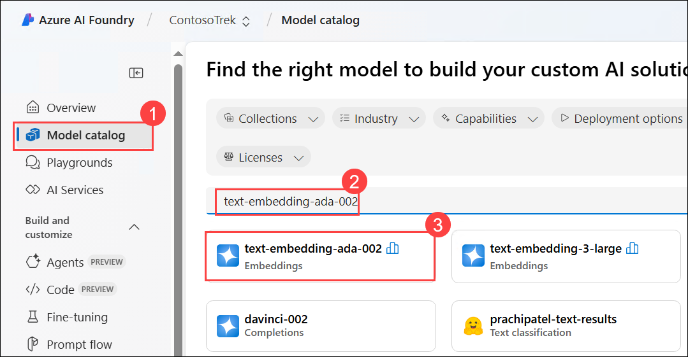

1. Click on **Deploy**.

    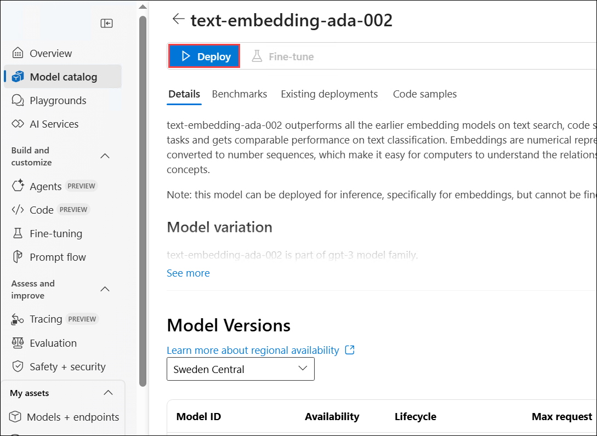

1. Click on **Deploy** again.

    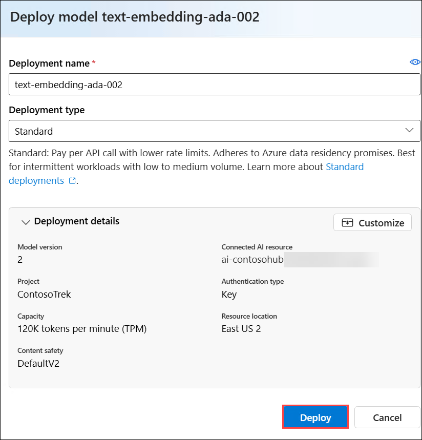

1. Click on **Models+Endpoints (1)**, you can see the deployed models **(2)**.

    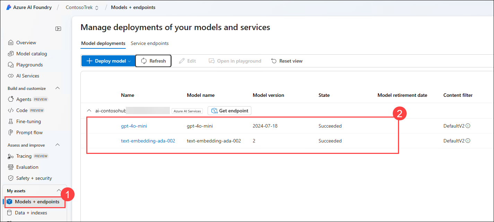

   > **Congratulations** on completing the task! Now, it's time to validate it. Here are the steps:    
   - Hit the validate button for the corresponding task. If you receive a success message, you can proceed to the next task.
   - If not, carefully read the error message and retry the step, following the instructions in the lab guide.
   - If you need any assistance, please contact us at cloudlabs-support@spektrasystems.com. We are available 24/7 to help you out.

   <validation step="9712c051-408a-4142-9efa-0337dca323d9" />    

### Task 3: Create an Azure AI Search Service

In this task, you will create an Azure AI Search service. You need an Azure AI Search service and connection to create a search index.

1. Right-click on [Create an Azure AI Search service](https://portal.azure.com/#create/Microsoft.Search), select **Copy link,** and then paste it into the LabVM browser to create an Azure AI Search service in the Azure portal.

1. On the **Create a search service** page, provide the following details, then click on **Review + create (6)**:
            
    - Subscription: **Leave your default subscription (1)**
    - Resource group: Select **ragsdk-<inject key="DeploymentID" enableCopy="false"/> (2)**
    - Service name: **aisearch-<inject key="DeploymentID" enableCopy="false"/> (3)**
    - Location: **<inject key="Region" enableCopy="false"/> (4)**
    - Pricing tier: **Standard (5)**

      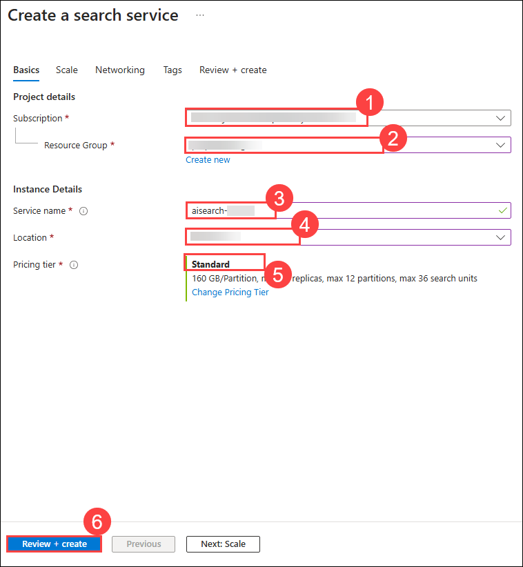
      
1. Click on **Create** on the **Review+create** page.

    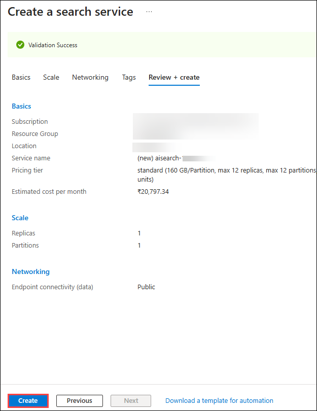

1. Wait for the deployment to complete.

   > **Congratulations** on completing the task! Now, it's time to validate it. Here are the steps:    
   - Hit the validate button for the corresponding task. If you receive a success message, you can proceed to the next task.
   - If not, carefully read the error message and retry the step, following the instructions in the lab guide.
   - If you need any assistance, please contact us at cloudlabs-support@spektrasystems.com. We are available 24/7 to help you out.

   <validation step="671b186b-85fe-413f-b791-7896dbfaf8c6" />


### Task 4: Connect the Azure AI Search to your Project

In this task, you will connect the Azure AI Search service to your project. Azure AI Search service and connection are used to create a search index. The search index is used to retrieve relevant documents based on the user's question.

1. Navigate back to the **Azure AI Foundry** portal, and select **Management center** from the left pane.

    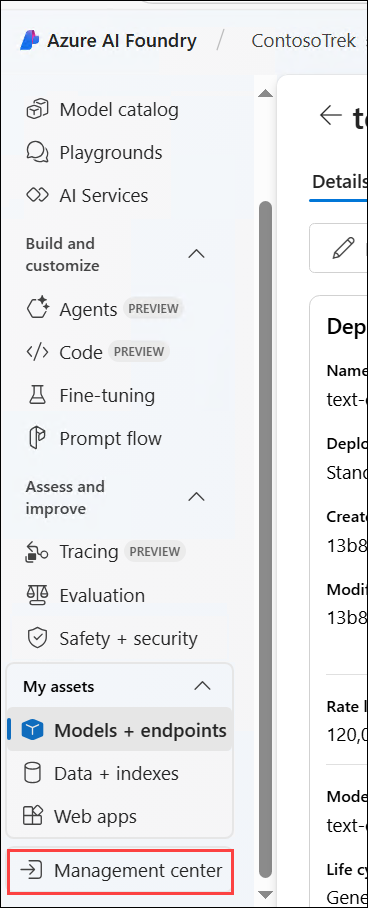

1. Select **Connected resources (1)** under the **Project (ContosoTrek)** section, then select **+ New connection (2)**.

    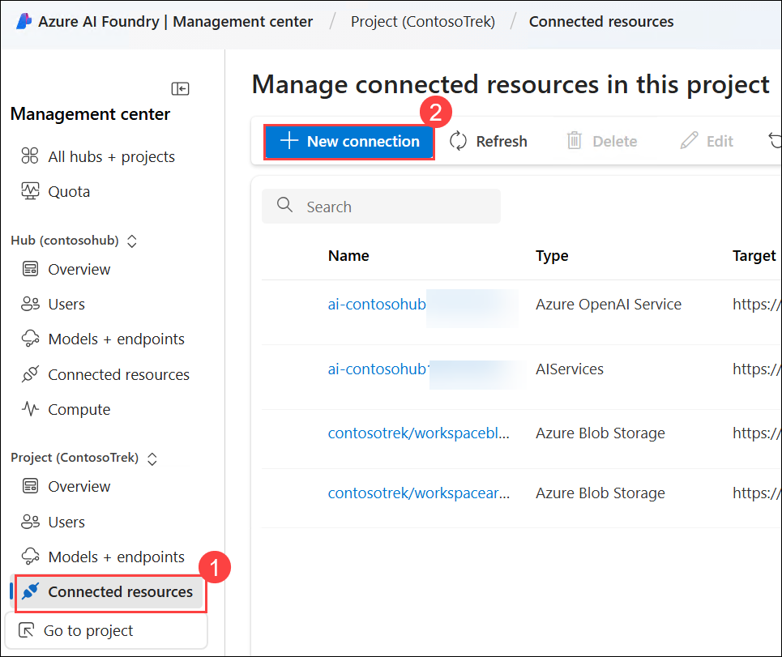

1. Search for Azure **AI Search (1)**, then select **Azure AI Search (2)**.

    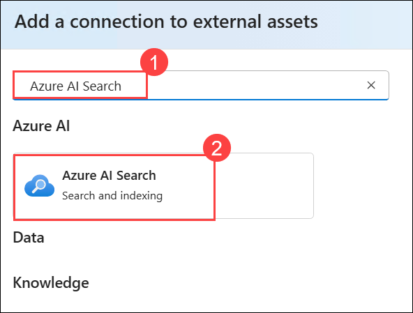

1. Search for the AI Search that is created by you, **aisearch-<inject key="DeploymentID" enableCopy="false"/> (1)**. Use the **API key (2)** for authentication and then select **Add connection (3)**.

    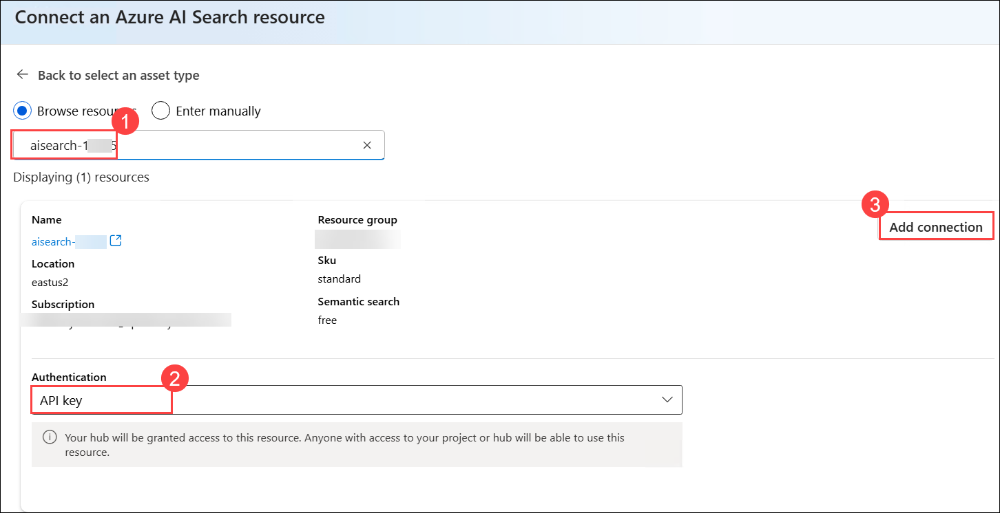

1. Make sure that AI Search is **Connected**.

    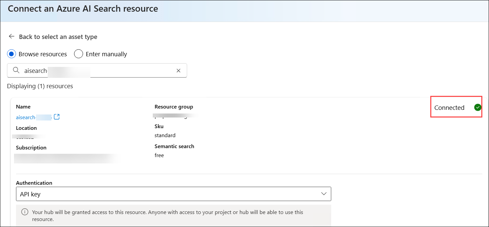

### Task 5: Clone the GitHub Repository for the Project

In this task, you will clone the GitHub repository for the project to access the necessary files for building the chat app.

1. Open the **Visual Studio Code** from the desktop.

    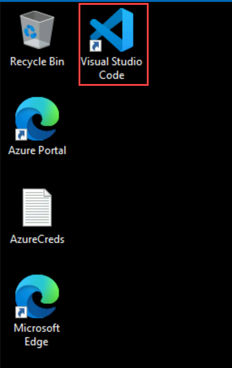

1. Click on the **ellipses (...) (1)**, select **Terminal (2),** and then click on **New Terminal (3)**.

    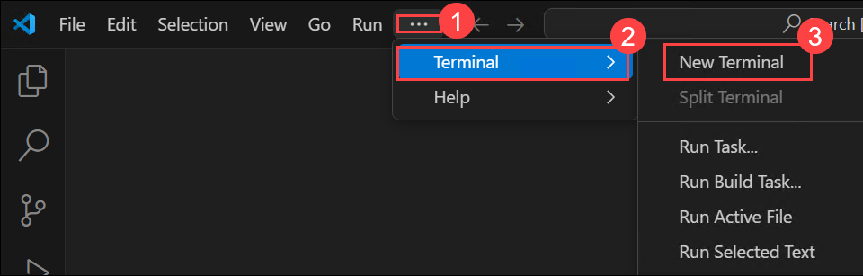

1. Enter the command below to clone the GitHub repository for the project to the **ContosoTrek** folder and access the necessary files for building the chat app.

   ```
   git clone https://github.com/Azure-Samples/azureai-samples.git C:\Users\demouser\Downloads\ContosoTrek
   ```

    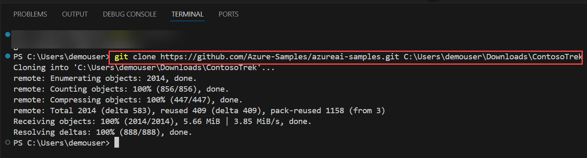

1. Click on **File (1)** from the top left corner, then select **Open Folder (2)**.

    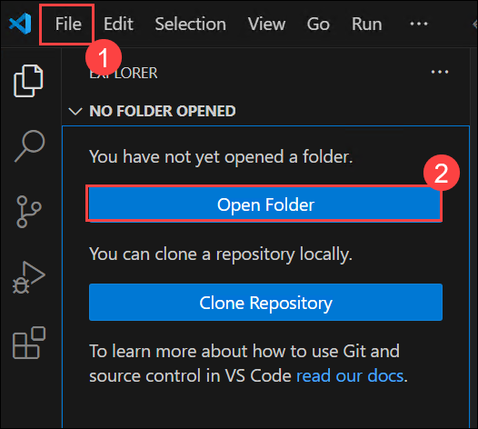

1. Navigate to **C:\Users\demouser\Downloads (1),** press **Enter**, select **ContosoTrek (2),** and then click on **Select Folder (3)**.

    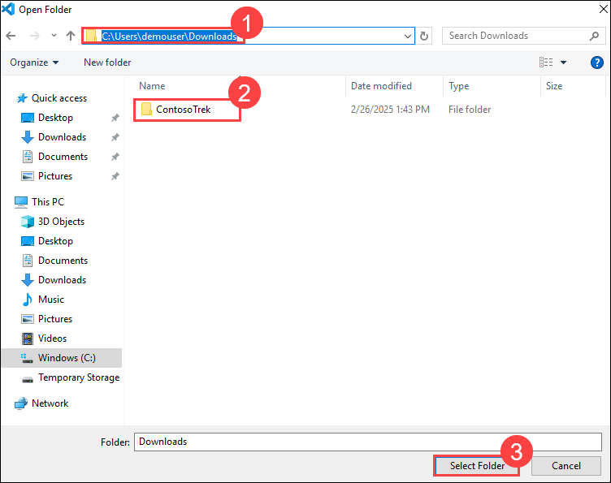

1. Click on **Yes, I trust the author**.

    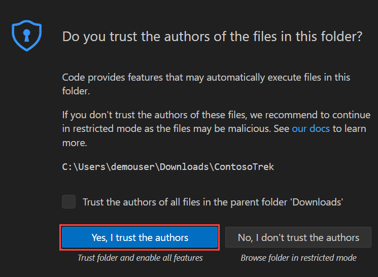

1. Expand **scenarios (1)**, then **rag/custom-rag-app (2)**. Select **requirements.txt (3)**. This file contains the necessary packages for setting up Azure AI Foundry SDK. **(4)**

    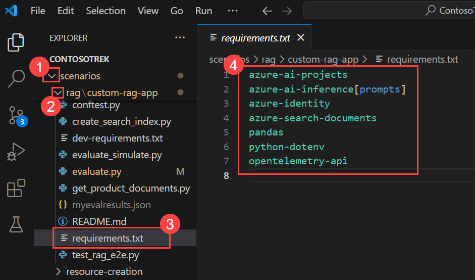

     >**Note**: This file contains the necessary packages for building and managing an AI-powered application using the Azure AI Foundry SDK, including authentication, AI inference, search, data processing, and telemetry logging.

1. Right-click on the **rag/custom-rag-app (1)** folder, then select **Open in Integrated Terminal (2)**.

    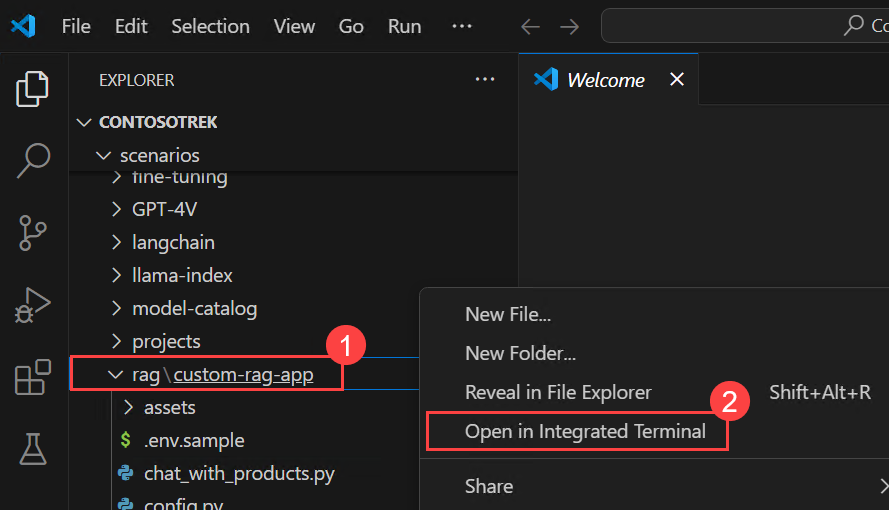

1. Install the required packages by running the following command.

    ```bash
    pip install -r requirements.txt
    ```

     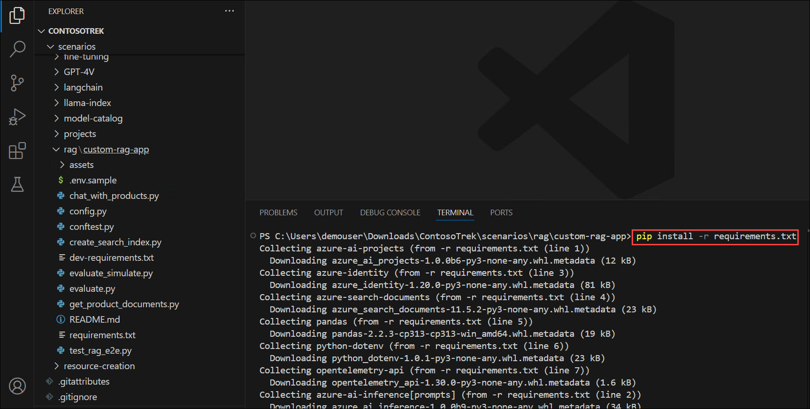    

      >**Note:** Wait for the installation to complete. It might take some time.

### Task 6: Configure Environment Variables

In this task, you will set up and configure the necessary environment variables to ensure seamless integration between your RAG application and Azure AI Foundry services.

1. Navigate back to the **Azure AI Foundry** portal. In **Azure AI Foundry | Management center**, click on **Go to project**.

    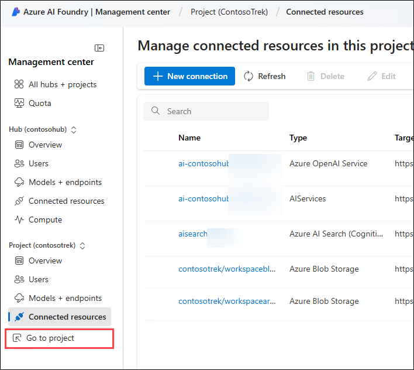

1. Navigate to **Overview (1)**, then copy and paste the **Project connection string (2)** into a notepad. You will be using it in the next step.

    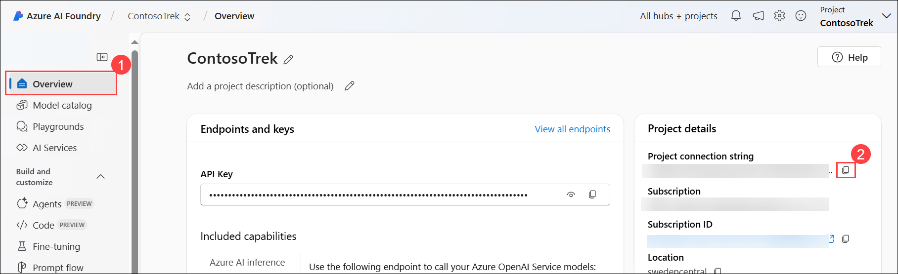

1. Get back to **Visual Studio Code**.

1. Right-click on **.env.sample (1)** and select **Rename (2)**.

    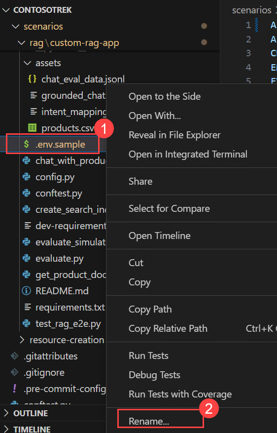

1. Rename the file to `.env`.

1. Click on the `.env` **(1)** file and replace **your_connection_string (2)** with the **Project connection string** you copied in Step 2.

    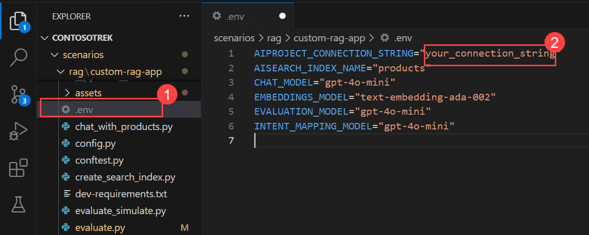

    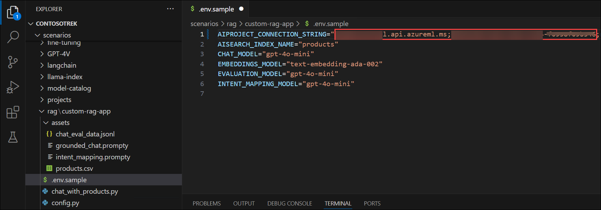

1. Press **Ctrl+S** to save the file.

### Review

This exercise guided participants through setting up a project in Azure AI Foundry, deploying and managing AI models, and creating an Azure AI Search service for efficient data retrieval. They integrated the search service with their project, cloned a GitHub repository containing necessary resources, and configured environment variables to ensure seamless execution.

In this exercise, you have accomplished the following:
- Task 1: Created a project
- Task 2: Deployed and Managed AI Models
- Task 3: Created an Azure AI Search service
- Task 4: Connected the Azure AI Search to your project
- Task 5: Cloned the GitHub repository for the project
- Task 6: Configured environment variables

### You have successfully finished the exercise. Click **Next** to continue to the next exercise.


