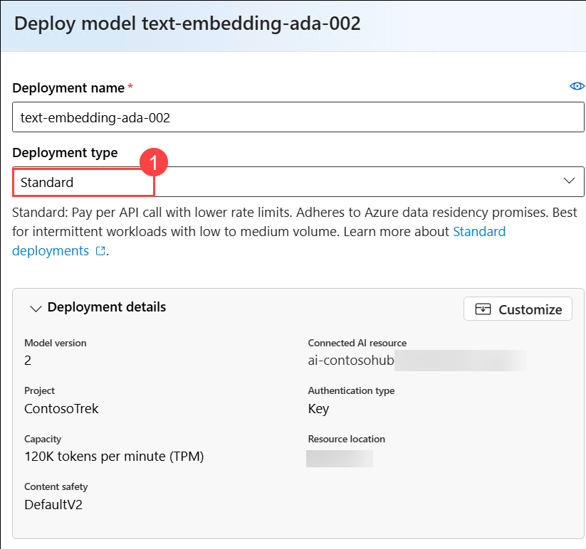

# Lab : Build a custom knowledge retrieval (RAG) app with the Azure AI Foundry SDK

## Lab scenario

In this Hands-On Lab, you will learn how to build a custom knowledge retrieval-augmented generation (RAG) application using the Azure AI Foundry SDK. This lab will guide you through provisioning necessary resources, implementing a retrieval pipeline, and evaluating the system’s performance. By the end of the session, you will have a functional RAG solution that integrates Azure AI capabilities for enhanced knowledge retrieval and response generation. 

## Lab Objectives

In this lab, you will complete the following exercises:

- Exercise 1: Set Up Azure AI Foundry SDK and Provision Resources 
- Exercise 2: Build a Retrieval-Augmented Generation (RAG) Pipeline 
- Exercise 3: Evaluate and Optimize RAG Performance 

## Estimated time: 4 hour

## Exercise 1: Set Up Azure AI Foundry SDK and Provision Resources 

### Task 1: Create a project

1. Navigate to the Home page of A**zure AI Foundry** by right-clicking on [Azure AI Foundry](https://ai.azure.com), selecting **Copy link**, and pasting it into your browser.

1. Click on **Sign in**.

     

1. Select **+ Create project**.

     

1. Enter a name for the project as **ContosoTrek (1)**, then click on **Customize (2)**.

     

1. On the **Create a project** page, provide the following details and then click on **Next (6)**:

    - Hub name: **ContosoHub (1)**

      >**Note**: If you see a permission error, just ignore it. It will go away after selecting the required resource group.

    - Subscription: **Leave the default subscription (2)**
    - Resource group: **ragsdk-<inject key="DeploymentID" enableCopy="false"/> (3)** 
    - Location: **<inject key="Region" enableCopy="false"/> (4)**
    - Connect Azure AI Services or Azure OpenAI Service: **Leave default (5)**

           

1. Click on **Create** on *Review and finish* page.

    

1. Wait until the resources are created.

    


## Task 2: Deploying and Managing AI Models 

1. On the left navigation pane, select **Model catalog (1)**. Search for **gpt-4o-mini (2)** and then select **gpt-4o-mini (3)**.

    

1. Click on **Deploy**.

    

1. Click on **Deploy** again.

    

1. Click on **Model catalog (1)** twice, search for **text-embedding-ada-002 (2)** and then select **text-embedding-ada-002 (3)**.

    

1. Click on **Deploy**.

    

1. Click on **Deploy** again.

    

1. You can see the deployed models.

    

## Task 3: Create an Azure AI Search service

1. Right click on [Create an Azure AI Search service](https://portal.azure.com/#create/Microsoft.Search) , click on **Copy link** and then paste it on the LabVM browser to create Azure AI Search service in the Azure portal.

1. On the **Create a search service** page, provide the following details then click on **Review + create (6)**:

    - Subscription: **Leave your default subscription (1)**
    - Resource group: **rag-1234 (2)**
    - Service name: **aisearch-12345 (3)**
    - Location: **Sweden central (4)**
    - Pricing tier: **Standard (5)**

          

1. Click on **Create** on *Review+create* page.

    

1. Wait for the deployment to complete.


## Task 4: Connect the Azure AI Search to your project

1. Navigate back to **Azure AI Foundary** portal, select **Management center** from the left pane.

    

1. Select **Connected resources (1)** then select **+ New connection (2)**.

    

1. Search for Azure **AI Search (1)**, then select **Azure AI Search (2)**.

    

1. Search for the AI Search that is created by you **aisearch-1234 (1)**, use **API key (2)** for Authentication and then select **Add connection (3)**.

    

1. Make sure that AI Seach is **Connected**.

    

### Task 5: Clone the GitHub repository for the project

1. Open the **Visual Studio Code** from the desktop.

1. Navigate to the **elipses(...) (1)**, click on **Terminal (2)** and then click on **New Terminal (3)**.

    

1. Clone the GitHub repository for the project to the **Downloads\ContosoTrek** folder to to access the necessary files for building the chat app.

   ```
   git clone https://github.com/Azure-Samples/azureai-samples.git C:\Users\demouser\Downloads\ContosoTrek
   ```

    

1. Click on **File (1)** from the top left corner, then select **Open Folder (2)**.

    

1. Navigate to **Downloads (1)**, select **ContosoTrek (2)** and then click on **Select Folder (3)**.

    

1. Click on **Yes, I trust the author**.

    

1. Expand **scenarios (1)**, then **rag/custom-rag-app (2)**. Select **requirements.txt (3)**. This file contains the necessary packages for setting up Azure AI Foundry SDK. **(4)**

    

     >**Note**: This file contains the necessary packages for building and managing an AI-powered application using the Azure AI Foundry SDK, including authentication, AI inference, search, data processing, and telemetry logging.

1. Right click on **rag/custom-rag-app (1)** folder, then select **Open in Integrated Terminal (2)**.

    

1. Install the required packages by running the following command.

    ```bash
    pip install -r requirements.txt
    ```

         

      >**Note:** Wait for the installation to complete, it might take some time.

### Task 6: Configure environment variables

1. Navigate back to the **Azure AI Foundary** portal. If your in **Azure AI Foundary | Management center**, click on **Go to project**.

    

1. Navigate to **Overview (1)**, then copy and paste the **Project connection string (2)** in a notepad. You will be using it in next step.

    

1. Get back to **Visual studio code**.

1. Right click on **.env.sample (1)**, click on **Rename (2)**.

    

1. Rename the file to `.env`.

1. Click on `.env` **(1)** file, replace **your_connection_string (2)** with the **Project connection string** that you had copied in Step 2.

    


    

1. Press **Ctrl+S** to save the file.


